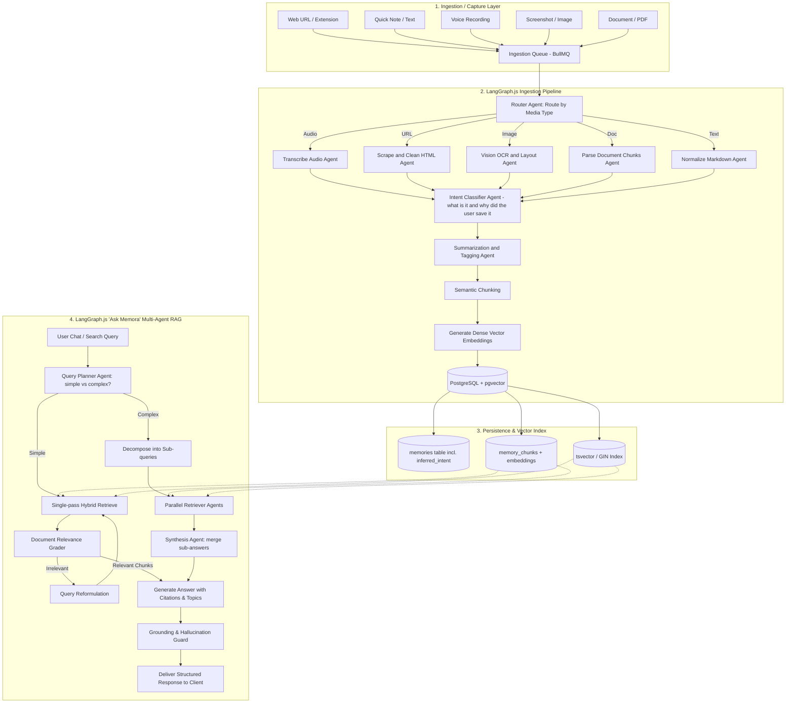
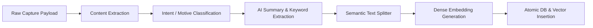
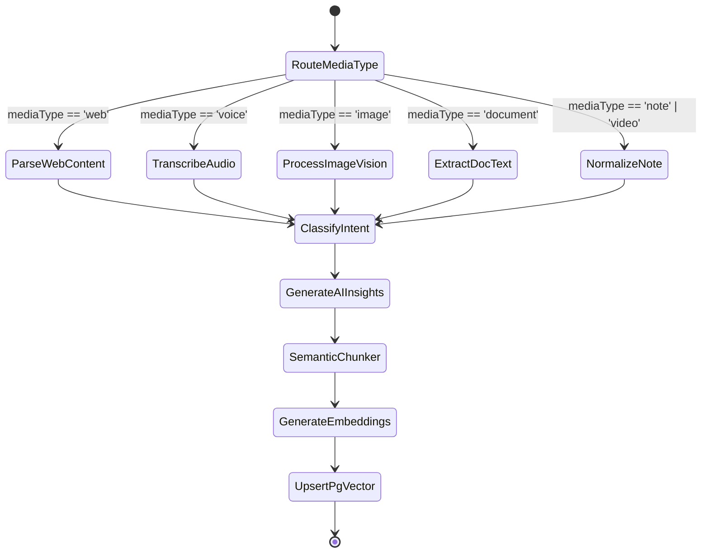
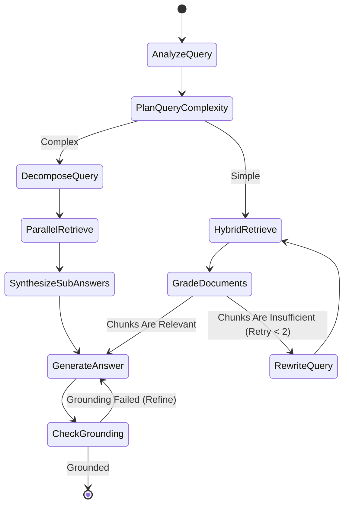

# MEMORA AI Architecture & Pipeline Requirements

## 1. Document & System Overview

### Purpose
This document specifies the technical architecture, data flow, agentic workflows, and implementation requirements for the **AI Ingestion, Indexing, and Retrieval Subsystems** of Memora.

**Status: documentation only — nothing in this document is installed or implemented yet.** `server/` currently has no `langchain`, `@langchain/langgraph`, or LLM SDK packages, and no `memories`/`memory_chunks` tables exist in `server/src/db/schema.ts`. This doc describes the target architecture for whenever that work starts, written in TypeScript to match the actual backend stack (Express + TypeScript + Drizzle ORM) — an earlier version of this doc used Python (`langgraph`/`langchain_core`) blueprints, which don't match this codebase and have been replaced below.

The AI system is responsible for:
1. **Multi-Modal Ingestion Pipeline:** Ingesting, parsing, transcribing, summarizing, tagging, and indexing URLs, notes, images, voice recordings, videos, and documents into a structured memory graph.
2. **Intent & Motive Inference:** Beyond describing *what* a captured item is, inferring *why the user likely saved it* — a link's category and purpose, an image's inferred motive (design reference? receipt? shopping wishlist? debugging note?), a note's intent (idea, task, quote, journal entry). This is a first-class classification step, not an afterthought of summarization.
3. **Hybrid Vector & Lexical Search:** Storing and querying vector embeddings alongside full-text inverted indexes in PostgreSQL using `pgvector`.
4. **Agentic RAG Engine ("Ask Memora"):** Executing multi-step reasoning, query rewriting, self-grading, and grounded conversational memory synthesis — with a deeper multi-agent decomposition path for complex queries — using **LangChain.js** and **LangGraph.js**.
5. **Autonomous Insights & Knowledge Graph:** Generating semantic relationship graphs, topic clustering, and forgotten memory rediscovery ("Forgotten Gems").

---

### Technology Stack

| Layer | Technology | Role / Purpose |
|---|---|---|
| **Agentic Framework** | **LangGraph.js** (`@langchain/langgraph`) | State graph orchestrator for the ingestion pipeline and the multi-agent RAG pipeline, running inside the existing Node/Express backend |
| **LLM & Tooling SDK** | **LangChain.js** (`langchain` / `@langchain/core`) | Prompts, parsers, document loaders, vector store abstractions, tool calling — TypeScript equivalents of the Python APIs, not the Python packages themselves |
| **Vector Database** | **PostgreSQL + `pgvector`** (v0.7+) | Hybrid dense vector search (HNSW index) + sparse BM25/FTS search with strict tenant isolation. Runs in the same Postgres instance already provisioned via `server/docker-compose.yml` |
| **Primary Reasoning LLM** | Anthropic Claude / OpenAI GPT-4-class / Google Gemini Pro-class | High-reasoning chat synthesis, query decomposition, complex extraction — multi-provider by design, not locked to one vendor |
| **Fast Extraction & Grading LLM** | OpenAI GPT-4o-mini-class / Google Gemini Flash-class | High-speed ingestion summarization, auto-tagging, relevance grading, title generation, and intent/motive classification |
| **Embeddings Model** | `text-embedding-3-small` (1536d) or `bge-large-en-v1.5` (1024d) | Dense semantic vector representation for chunks and parent documents |
| **Speech-to-Text (STT)** | OpenAI Whisper / Groq Whisper / Deepgram Nova-class | Audio transcription for voice memos |
| **Vision & OCR** | GPT-4o-mini-class Vision / Gemini Flash-class Vision / Tesseract | Screenshot analysis, OCR extraction, UI layout tagging, and motive inference for images |
| **Async Task Queue** | **BullMQ** + Redis | Distributed background job worker for scraping, transcribing, and embedding generation. `REDIS_URL` is already a required env var in `server/src/config/env.ts`, so this queue can be added without new infra |

---

### High-Level Architecture Flow



---

## 2. Ingestion & Preprocessing Pipeline (AI Insertion)

The ingestion pipeline handles raw unstructured data from all clients (Chrome Extension, Mobile App, Web Client), parses content, **classifies what the content is and infers why the user likely saved it**, generates vector embeddings, and stores records atomically.

### Modality Preprocessing Specifications



#### 1. Web Pages & URLs
- **Input:** URL, optional initial HTML, page title, favicon from Chrome extension or mobile share sheet.
- **Processing:**
  1. Fetch full page using a headless engine (Playwright / Chromium / Readability-style extractor) with fallback to a raw HTTP client.
  2. Strip navigation headers, cookie banners, advertisements, footers, scripts, and CSS.
  3. Extract OpenGraph (`og:title`, `og:description`, `og:image`), meta keywords, author, and publish date.
  4. Convert article content into clean Markdown.
  5. **Classify resource type**: article, documentation, tool/SaaS product, social post, video page, pricing page, product listing, forum/Q&A, other — plus a topic/category label (e.g. "Design", "AI/ML", "Finance").

#### 2. Personal Notes & Quick Captures
- **Input:** Raw markdown/plaintext from mobile quick note or web dialog.
- **Processing:**
  1. Extract title from first line if not explicitly supplied (max 60 chars).
  2. Clean and format markdown.
  3. **Classify intent**: idea/brainstorm, task/reminder, quote/excerpt, journal entry, draft-in-progress, reference note — replacing the original generic "conceptual context" pass with an explicit intent label.

#### 3. Audio & Voice Memos
- **Input:** Binary audio file (`.wav`, `.m4a`, `.mp3`) uploaded from mobile voice capture.
- **Processing:**
  1. Send binary audio to a Whisper-class STT model with prompt bias for technical vocabulary.
  2. Generate raw text transcript with timestamps.
  3. LLM cleanup pass: remove filler words ("um", "ah"), fix punctuation, format bullet points.
  4. **Classify intent** on the cleaned transcript using the same intent taxonomy as notes (idea, task, quote, journal, reference).
  5. Generate a concise title, 2-sentence summary, and extracted key topics.

#### 4. Images & Screenshots
- **Input:** Image binary (`.png`, `.jpeg`, `.webp`) from context menu or mobile gallery.
- **Processing:**
  1. Pass image to a multimodal vision model.
  2. Run OCR to extract any embedded text.
  3. **Infer why the user likely saved this image** — a dedicated classification pass distinct from OCR/description, over a taxonomy such as: `ui_design_inspiration`, `code_snippet_reference`, `receipt_or_document`, `shopping_wishlist_item`, `error_message_to_debug`, `recipe`, `meme_or_entertainment`, `screenshot_of_conversation`, `other`. This is the field that answers "what may be the user's motive" rather than just "what's in the picture."
  4. Generate a structured description: UI components, color palette, design style (when relevant to the inferred motive), thematic keywords.
  5. Store OCR text into `content`, the descriptive breakdown into `description`, and the motive classification into `inferred_intent`.

#### 5. Videos (e.g., YouTube)
- **Input:** YouTube video URL or direct video link.
- **Processing:**
  1. Extract video ID and fetch timed captions via a transcript API.
  2. If captions are unavailable, stream the audio track to STT.
  3. **Classify content type**: tutorial/how-to, entertainment, lecture/talk, product review, other.
  4. Chunk transcript into logical chapters with start-time offsets.

#### 6. Documents & PDFs
- **Input:** `.pdf`, `.docx`, `.txt`, `.md` binary uploads.
- **Processing:**
  1. Parse text using a PDF/document extraction library.
  2. Extract document headers, section hierarchy, and table markdown structures.
  3. **Classify document type**: reference manual, contract/legal, research paper, personal record, other.
  4. Chunk by section boundaries.

Every modality above converges on a common shape before the shared summarization stage:

```typescript
interface IntentClassification {
  resourceCategory: string;   // e.g. "article", "ui_design_inspiration", "task_reminder"
  inferredIntent: string;     // one-sentence explanation of the likely reason for saving
  confidence: number;         // 0-1
}
```

---

## 3. Chunking, Summarization & Tagging Pipeline

### Chunking Strategy
Memora employs a two-tier embedding hierarchy:
1. **Document-Level Embedding:** Encodes the entire memory (Title + Summary + Inferred Intent + Top Tags) into a single 1536-dimensional vector for fast macro-clustering, graph generation, and "Related Memories" calculation.
2. **Chunk-Level Embeddings:** Encodes sub-sections of long web pages, transcripts, and documents for fine-grained chunk retrieval in RAG.

```typescript
// Semantic chunking configuration specification
const CHUNK_SIZE = 800;        // Approximate tokens
const CHUNK_OVERLAP = 120;     // Token overlap to preserve cross-boundary context
const SEPARATORS = ["\n## ", "\n### ", "\n\n", "\n", ". ", " "];
```

### Auto-Tagging & Taxonomy Deduplication
To prevent tag proliferation (e.g., creating both `Postgres`, `PostgreSQL`, and `postgres-db`), the backend uses a normalization algorithm:
1. LLM extracts 3–6 relevant candidate tags, informed by both the content and the `inferredIntent` classification.
2. The candidates are fuzzy-matched (`pg_trgm` similarity ≥ 0.85) against the user's existing tag repository.
3. If a match exists, the existing tag is reused; otherwise, the new tag is created.

---

## 4. PostgreSQL + `pgvector` Database Schema

### Database Extensions Required
```sql
CREATE EXTENSION IF NOT EXISTS "uuid-ossp";
CREATE EXTENSION IF NOT EXISTS "vector";
CREATE EXTENSION IF NOT EXISTS "pg_trgm";
```

### Vector Tables DDL

```sql
-- 1. Memory Chunks Table for Fine-Grained RAG
CREATE TABLE memory_chunks (
    id UUID PRIMARY KEY DEFAULT gen_random_uuid(),
    memory_id UUID NOT NULL REFERENCES memories(id) ON DELETE CASCADE,
    user_id UUID NOT NULL REFERENCES users(id) ON DELETE CASCADE,
    chunk_index INT NOT NULL,
    chunk_content TEXT NOT NULL,
    token_count INT NOT NULL,
    embedding vector(1536) NOT NULL, -- Matches text-embedding-3-small (1536d)
    metadata JSONB DEFAULT '{}'::jsonb,
    created_at TIMESTAMPTZ DEFAULT NOW()
);

-- 2. Document-Level Embedding, FTS, and Intent Classification columns on memories Table
ALTER TABLE memories ADD COLUMN IF NOT EXISTS document_embedding vector(1536);
ALTER TABLE memories ADD COLUMN IF NOT EXISTS fts_tokens tsvector;
ALTER TABLE memories ADD COLUMN IF NOT EXISTS resource_category TEXT;
ALTER TABLE memories ADD COLUMN IF NOT EXISTS inferred_intent TEXT;
ALTER TABLE memories ADD COLUMN IF NOT EXISTS intent_confidence REAL;

-- 3. HNSW Vector Indexes for Sub-Millisecond Cosine Distance Search
CREATE INDEX idx_memory_chunks_embedding_hnsw 
ON memory_chunks 
USING hnsw (embedding vector_cosine_ops)
WITH (m = 16, ef_construction = 64);

CREATE INDEX idx_memories_doc_embedding_hnsw 
ON memories 
USING hnsw (document_embedding vector_cosine_ops)
WITH (m = 16, ef_construction = 64);

-- 4. Composite Multi-Tenant Indexes for Fast Filtered Vector Search
CREATE INDEX idx_memory_chunks_user_memory 
ON memory_chunks (user_id, memory_id);

-- 5. Full-Text Search (GIN) Index for Hybrid Search
CREATE INDEX idx_memories_fts 
ON memories 
USING gin (fts_tokens);

-- 6. Trigger to automatically maintain tsvector for Full-Text Search
CREATE OR REPLACE FUNCTION memories_fts_trigger() RETURNS trigger AS $$
BEGIN
    NEW.fts_tokens := setweight(to_tsvector('english', coalesce(NEW.title, '')), 'A') ||
                      setweight(to_tsvector('english', coalesce(NEW.description, '')), 'B') ||
                      setweight(to_tsvector('english', coalesce(NEW.inferred_intent, '')), 'B') ||
                      setweight(to_tsvector('english', coalesce(NEW.content, '')), 'C');
    RETURN NEW;
END
$$ LANGUAGE plpgsql;

CREATE TRIGGER trg_memories_fts_update
BEFORE INSERT OR UPDATE ON memories
FOR EACH ROW EXECUTE FUNCTION memories_fts_trigger();
```

*`resource_category`, `inferred_intent`, and `intent_confidence` are additive to the `memories` table already specified in `docs/BACKEND_REQUIREMENTS.md` (Section 5, table 9) — that doc should be updated to include them when this pipeline is implemented.*

---

### Hybrid Search Implementation (Dense Vector + BM25 Lexical with RRF)

To achieve superior recall on exact keywords (e.g. library names, URLs, specific dates) AND semantic concepts (e.g. "guides on database optimization"), the backend combines vector distance and full-text ranking using **Reciprocal Rank Fusion (RRF)**:

```sql
-- Hybrid Search Query with User Isolation
WITH semantic_search AS (
    SELECT 
        mc.memory_id,
        mc.id AS chunk_id,
        mc.chunk_content,
        1 - (mc.embedding <=> $1::vector) AS similarity_score,
        ROW_NUMBER() OVER (ORDER BY mc.embedding <=> $1::vector) AS rank
    FROM memory_chunks mc
    WHERE mc.user_id = $2
    ORDER BY mc.embedding <=> $1::vector
    LIMIT 25
),
lexical_search AS (
    SELECT 
        m.id AS memory_id,
        m.id AS chunk_id,
        m.title || ' ' || coalesce(m.description, '') AS chunk_content,
        ts_rank_cd(m.fts_tokens, plainto_tsquery('english', $3)) AS text_score,
        ROW_NUMBER() OVER (ORDER BY ts_rank_cd(m.fts_tokens, plainto_tsquery('english', $3)) DESC) AS rank
    FROM memories m
    WHERE m.user_id = $2
      AND m.in_trash = false
      AND m.fts_tokens @@ plainto_tsquery('english', $3)
    LIMIT 25
)
SELECT 
    coalesce(s.memory_id, l.memory_id) AS memory_id,
    coalesce(s.chunk_content, l.chunk_content) AS content,
    (
        coalesce(1.0 / (60 + s.rank), 0.0) + 
        coalesce(1.0 / (60 + l.rank), 0.0)
    ) AS rrf_score
FROM semantic_search s
FULL OUTER JOIN lexical_search l 
    ON s.memory_id = l.memory_id
ORDER BY rrf_score DESC
LIMIT 10;
```

---

## 5. Multi-Agent Ingestion Pipeline (`MemoryIngestionGraph`)

The ingestion pipeline is structured as a deterministic multi-agent state graph using **LangGraph.js**, running as a BullMQ worker inside the Node/Express backend. Each stage is a distinct agent rather than one monolithic per-type function, so individual stages (e.g. the Intent Classifier) can be tested, swapped, or given a different model independently of the rest of the pipeline.

### LangGraph.js State Schema

```typescript
import { Annotation } from "@langchain/langgraph";

interface IngestionMetadata {
  title?: string;
  sourceDomain?: string;
  favicon?: string;
  author?: string;
  ogImage?: string;
}

const IngestionState = Annotation.Root({
  memoryId: Annotation<string>,
  userId: Annotation<string>,
  mediaType: Annotation<"web" | "video" | "note" | "image" | "document" | "voice">,
  rawInput: Annotation<Record<string, unknown>>,       // Raw URL, text, or file buffer reference
  cleanedContent: Annotation<string>,                  // Normalized markdown content
  metadata: Annotation<IngestionMetadata>,
  intent: Annotation<IntentClassification | undefined>,
  summary: Annotation<string>,                         // 2-3 sentence AI summary
  suggestedTags: Annotation<string[]>,
  chunks: Annotation<string[]>,                        // Semantic chunks for vector store
  chunkEmbeddings: Annotation<number[][]>,
  documentEmbedding: Annotation<number[]>,
  status: Annotation<"processing" | "indexed" | "failed">,
  errorMessage: Annotation<string | undefined>,
});

type IngestionStateType = typeof IngestionState.State;
```

### Ingestion Graph State Machine Diagram



### Node Implementation Blueprint

```typescript
import { StateGraph, END, START } from "@langchain/langgraph";
import { ChatPromptTemplate } from "@langchain/core/prompts";
import { JsonOutputParser, StringOutputParser } from "@langchain/core/output_parsers";
import { RecursiveCharacterTextSplitter } from "langchain/text_splitter";

// fastLlm: cheap/fast model (extraction, tagging, grading, intent classification)
// embeddingsModel: provider-agnostic embeddings client
// dbService: Drizzle-backed persistence layer

function routeMediaType(state: IngestionStateType): string {
  const routes: Record<string, string> = {
    web: "parseWebContent",
    voice: "transcribeAudio",
    image: "processImageVision",
    document: "extractDocText",
    note: "normalizeNote",
  };
  return routes[state.mediaType] ?? "normalizeNote";
}

async function classifyIntent(state: IngestionStateType): Promise<Partial<IngestionStateType>> {
  const taxonomyByType: Record<string, string[]> = {
    web: ["article", "documentation", "tool_or_saas", "social_post", "video_page", "pricing_page", "product_listing", "forum_or_qa", "other"],
    image: ["ui_design_inspiration", "code_snippet_reference", "receipt_or_document", "shopping_wishlist_item", "error_message_to_debug", "recipe", "meme_or_entertainment", "screenshot_of_conversation", "other"],
    note: ["idea_or_brainstorm", "task_or_reminder", "quote_or_excerpt", "journal_entry", "draft_in_progress", "reference_note"],
    voice: ["idea_or_brainstorm", "task_or_reminder", "quote_or_excerpt", "journal_entry", "reference_note"],
    video: ["tutorial", "entertainment", "lecture_or_talk", "product_review", "other"],
    document: ["reference_manual", "contract_or_legal", "research_paper", "personal_record", "other"],
  };

  const prompt = ChatPromptTemplate.fromTemplate(
    `Classify the following captured content. Choose the single best category from: {categories}.
Then explain in one sentence why the user most likely saved this.
Content:
{content}

Respond as strict JSON: {{"resourceCategory": "...", "inferredIntent": "...", "confidence": 0.0}}`
  );

  const chain = prompt.pipe(fastLlm).pipe(new JsonOutputParser<IntentClassification>());
  const intent = await chain.invoke({
    categories: (taxonomyByType[state.mediaType] ?? ["other"]).join(", "),
    content: state.cleanedContent.slice(0, 4000),
  });

  return { intent };
}

async function generateAiInsights(state: IngestionStateType): Promise<Partial<IngestionStateType>> {
  const prompt = ChatPromptTemplate.fromTemplate(
    `Analyze the following captured memory content and its inferred intent, and generate a structured JSON object.
Content:
{content}

Inferred intent: {inferredIntent} (category: {resourceCategory})

Respond with valid JSON matching this schema:
{{
  "title": "Clear concise title (max 8 words)",
  "summary": "2-3 sentence overview highlighting core concepts and significance",
  "suggestedTags": ["Tag1", "Tag2", "Tag3"]
}}`
  );

  interface Insights { title: string; summary: string; suggestedTags: string[] }
  const chain = prompt.pipe(fastLlm).pipe(new JsonOutputParser<Insights>());
  const insights = await chain.invoke({
    content: state.cleanedContent.slice(0, 4000),
    inferredIntent: state.intent?.inferredIntent ?? "",
    resourceCategory: state.intent?.resourceCategory ?? "",
  });

  return {
    summary: insights.summary,
    suggestedTags: insights.suggestedTags,
    metadata: { ...state.metadata, title: insights.title ?? state.metadata.title },
  };
}

function semanticChunker(state: IngestionStateType): Partial<IngestionStateType> {
  const splitter = new RecursiveCharacterTextSplitter({
    chunkSize: 800,
    chunkOverlap: 120,
    separators: ["\n## ", "\n### ", "\n\n", "\n", ". ", " "],
  });
  return { chunks: splitter.splitText(state.cleanedContent) };
}

async function generateEmbeddings(state: IngestionStateType): Promise<Partial<IngestionStateType>> {
  const docText = [
    state.metadata.title ?? "",
    state.summary,
    state.intent?.inferredIntent ?? "",
    `Tags: ${state.suggestedTags.join(", ")}`,
  ].join("\n");

  const [documentEmbedding, chunkEmbeddings] = await Promise.all([
    embeddingsModel.embedQuery(docText),
    embeddingsModel.embedDocuments(state.chunks),
  ]);

  return { documentEmbedding, chunkEmbeddings };
}

async function upsertPgVector(state: IngestionStateType): Promise<Partial<IngestionStateType>> {
  await dbService.saveMemoryWithVectors({
    memoryId: state.memoryId,
    userId: state.userId,
    title: state.metadata.title,
    summary: state.summary,
    tags: state.suggestedTags,
    resourceCategory: state.intent?.resourceCategory,
    inferredIntent: state.intent?.inferredIntent,
    intentConfidence: state.intent?.confidence,
    documentEmbedding: state.documentEmbedding,
    chunks: state.chunks,
    chunkEmbeddings: state.chunkEmbeddings,
  });
  return { status: "indexed" };
}

// Build Ingestion StateGraph
const ingestionGraph = new StateGraph(IngestionState)
  .addNode("parseWebContent", parseWebContentNode)
  .addNode("transcribeAudio", transcribeAudioNode)
  .addNode("processImageVision", processImageVisionNode)
  .addNode("extractDocText", extractDocTextNode)
  .addNode("normalizeNote", normalizeNoteNode)
  .addNode("classifyIntent", classifyIntent)
  .addNode("generateAiInsights", generateAiInsights)
  .addNode("semanticChunker", semanticChunker)
  .addNode("generateEmbeddings", generateEmbeddings)
  .addNode("upsertPgVector", upsertPgVector)
  .addConditionalEdges(START, routeMediaType, {
    parseWebContent: "parseWebContent",
    transcribeAudio: "transcribeAudio",
    processImageVision: "processImageVision",
    extractDocText: "extractDocText",
    normalizeNote: "normalizeNote",
  });

for (const parser of ["parseWebContent", "transcribeAudio", "processImageVision", "extractDocText", "normalizeNote"] as const) {
  ingestionGraph.addEdge(parser, "classifyIntent");
}

ingestionGraph
  .addEdge("classifyIntent", "generateAiInsights")
  .addEdge("generateAiInsights", "semanticChunker")
  .addEdge("semanticChunker", "generateEmbeddings")
  .addEdge("generateEmbeddings", "upsertPgVector")
  .addEdge("upsertPgVector", END);

export const compiledIngestionGraph = ingestionGraph.compile();
```

---

## 6. Multi-Agent "Ask Memora" RAG Pipeline

The "Ask Memora" conversational interface implements an **Agentic Corrective RAG (CRAG)** state machine to prevent hallucinations and provide cited answers based on the user's personal memories — with an additional **query-planning branch** so complex, multi-part questions get decomposed and answered with cross-referenced synthesis rather than a single shallow retrieval pass.

### LangGraph.js RAG State Schema

```typescript
import { Annotation } from "@langchain/langgraph";

interface RAGMessage {
  role: "user" | "assistant";
  content: string;
}

interface RetrievedChunk {
  memoryId: string;
  title?: string;
  content: string;
}

const RAGState = Annotation.Root({
  userId: Annotation<string>,
  query: Annotation<string>,
  chatHistory: Annotation<RAGMessage[]>,
  rewrittenQuery: Annotation<string | undefined>,
  complexity: Annotation<"simple" | "complex" | undefined>,
  subQueries: Annotation<string[]>,
  subAnswers: Annotation<string[]>,
  retrievedChunks: Annotation<RetrievedChunk[]>,
  gradedChunks: Annotation<RetrievedChunk[]>,
  retryCount: Annotation<number>,
  answer: Annotation<string>,
  topics: Annotation<{ label: string; count: number }[]>,
  sources: Annotation<string[]>,
  grounded: Annotation<boolean>,
});

type RAGStateType = typeof RAGState.State;
```

### RAG State Graph Diagram



### Complete RAG Agent Implementation Blueprint

```typescript
import { StateGraph, END, START } from "@langchain/langgraph";
import { ChatPromptTemplate } from "@langchain/core/prompts";
import { StringOutputParser, JsonOutputParser } from "@langchain/core/output_parsers";

// fastLlm: cheap/fast model (query analysis, grading, rewriting, decomposition)
// reasoningLlm: high-reasoning model (final synthesis)
// embeddingsModel, dbService: as in Section 5

async function analyzeAndRewriteQuery(state: RAGStateType): Promise<Partial<RAGStateType>> {
  const prompt = ChatPromptTemplate.fromMessages([
    ["system", "You are an expert query optimizer for a personal knowledge base. Given a chat conversation and the latest user message, formulate a standalone search query that captures all necessary search context."],
    ["placeholder", "{chatHistory}"],
    ["human", "{query}"],
  ]);
  const chain = prompt.pipe(fastLlm).pipe(new StringOutputParser());
  const rewrittenQuery = await chain.invoke({
    chatHistory: state.chatHistory.map((m) => [m.role, m.content]),
    query: state.query,
  });
  return { rewrittenQuery };
}

async function planQueryComplexity(state: RAGStateType): Promise<Partial<RAGStateType>> {
  const prompt = ChatPromptTemplate.fromTemplate(
    `Classify this question as "simple" (answerable from a single focused retrieval) or "complex"
(multi-part, comparative, or requires synthesizing across many distinct memories).
Question: {query}
Respond as strict JSON: {{"complexity": "simple" | "complex"}}`
  );
  const chain = prompt.pipe(fastLlm).pipe(new JsonOutputParser<{ complexity: "simple" | "complex" }>());
  const { complexity } = await chain.invoke({ query: state.rewrittenQuery ?? state.query });
  return { complexity };
}

function routeByComplexity(state: RAGStateType): string {
  return state.complexity === "complex" ? "decomposeQuery" : "hybridRetrieve";
}

async function decomposeQuery(state: RAGStateType): Promise<Partial<RAGStateType>> {
  const prompt = ChatPromptTemplate.fromTemplate(
    `Break this complex question into 2-4 independent, self-contained sub-questions that together cover everything needed to answer it.
Question: {query}
Respond as strict JSON: {{"subQueries": ["...", "..."]}}`
  );
  const chain = prompt.pipe(fastLlm).pipe(new JsonOutputParser<{ subQueries: string[] }>());
  const { subQueries } = await chain.invoke({ query: state.rewrittenQuery ?? state.query });
  return { subQueries };
}

async function hybridSearch(userId: string, query: string, limit = 8): Promise<RetrievedChunk[]> {
  const queryVector = await embeddingsModel.embedQuery(query);
  return dbService.executeHybridRrfSearch({ userId, embedding: queryVector, searchText: query, limit });
}

async function hybridRetrieve(state: RAGStateType): Promise<Partial<RAGStateType>> {
  const query = state.rewrittenQuery ?? state.query;
  const retrievedChunks = await hybridSearch(state.userId, query);
  return { retrievedChunks };
}

async function parallelRetrieve(state: RAGStateType): Promise<Partial<RAGStateType>> {
  // Fan out: run hybrid retrieval + a quick answer for every sub-query concurrently.
  const subAnswers = await Promise.all(
    state.subQueries.map(async (subQuery) => {
      const chunks = await hybridSearch(state.userId, subQuery, 5);
      const context = chunks.map((c) => `--- ${c.title ?? "Untitled"} ---\n${c.content}`).join("\n\n");
      const prompt = ChatPromptTemplate.fromTemplate(
        `Answer this sub-question concisely using only the provided context.
Sub-question: {subQuery}
Context:
{context}`
      );
      const chain = prompt.pipe(fastLlm).pipe(new StringOutputParser());
      return chain.invoke({ subQuery, context });
    })
  );
  return { subAnswers };
}

async function synthesizeSubAnswers(state: RAGStateType): Promise<Partial<RAGStateType>> {
  const combined = state.subQueries
    .map((q, i) => `Sub-question: ${q}\nAnswer: ${state.subAnswers[i]}`)
    .join("\n\n");
  const prompt = ChatPromptTemplate.fromTemplate(
    `Synthesize these sub-answers into one coherent, cross-referenced answer to the original question.
Original question: {query}
Sub-answers:
{combined}`
  );
  const chain = prompt.pipe(reasoningLlm).pipe(new StringOutputParser());
  const answer = await chain.invoke({ query: state.query, combined });
  // Feed the synthesized draft into gradedChunks-equivalent context for the shared generateAnswer/grounding step.
  return { gradedChunks: [{ memoryId: "synthesized", content: answer }] };
}

async function gradeDocuments(state: RAGStateType): Promise<Partial<RAGStateType>> {
  const prompt = ChatPromptTemplate.fromTemplate(
    `You are a relevance grader. Evaluate if the retrieved memory snippet is relevant to the search question.
Question: {question}
Memory Snippet:
{snippet}
Answer strictly in JSON: {{"isRelevant": true}} or {{"isRelevant": false}}`
  );
  const chain = prompt.pipe(fastLlm).pipe(new JsonOutputParser<{ isRelevant: boolean }>());

  const graded: RetrievedChunk[] = [];
  for (const chunk of state.retrievedChunks) {
    const { isRelevant } = await chain.invoke({ question: state.query, snippet: chunk.content });
    if (isRelevant) graded.push(chunk);
  }
  return { gradedChunks: graded };
}

function checkRetrievalQuality(state: RAGStateType): string {
  if (state.gradedChunks.length > 0) return "generateAnswer";
  if (state.retryCount < 2) return "rewriteQuery";
  return "generateAnswer"; // Fallback to answer with available knowledge
}

async function rewriteQueryNode(state: RAGStateType): Promise<Partial<RAGStateType>> {
  const prompt = ChatPromptTemplate.fromTemplate(
    `The previous search query "{query}" did not return relevant memories.
Rephrase this query using different keywords, technical synonyms, and broader concepts.`
  );
  const chain = prompt.pipe(fastLlm).pipe(new StringOutputParser());
  const newQuery = await chain.invoke({ query: state.query });
  return { rewrittenQuery: newQuery, retryCount: state.retryCount + 1 };
}

interface GeneratedAnswer {
  response: string;
  topics: { label: string; count: number }[];
  sources: string[];
}

async function generateAnswer(state: RAGStateType): Promise<Partial<RAGStateType>> {
  const contextBlocks = state.gradedChunks
    .map((c) => `--- Memory: ${c.title ?? "Untitled"} (ID: ${c.memoryId}) ---\n${c.content}`)
    .join("\n\n");

  const prompt = ChatPromptTemplate.fromMessages([
    ["system", `You are Memora, the user's personal AI memory assistant.
Answer the user's question using ONLY the provided memory snippets. Be direct, helpful, and concise.
You MUST also provide:
1. A list of exact source titles you cited.
2. A topic frequency breakdown of the memories related to this question.
Output strict JSON: {{"response": "...", "topics": [{{"label": "...", "count": 0}}], "sources": ["..."]}}`],
    ["human", "Context:\n{context}\n\nQuestion: {query}"],
  ]);

  const chain = prompt.pipe(reasoningLlm).pipe(new JsonOutputParser<GeneratedAnswer>());
  const result = await chain.invoke({ context: contextBlocks, query: state.query });

  return {
    answer: result.response ?? "I could not find memories matching your question.",
    topics: result.topics ?? [],
    sources: result.sources ?? [],
  };
}

async function checkGrounding(state: RAGStateType): Promise<Partial<RAGStateType>> {
  const prompt = ChatPromptTemplate.fromTemplate(
    `Does this answer rely only on claims supported by the provided context, with no fabricated details?
Answer: {answer}
Respond strictly as JSON: {{"grounded": true}} or {{"grounded": false}}`
  );
  const chain = prompt.pipe(fastLlm).pipe(new JsonOutputParser<{ grounded: boolean }>());
  const { grounded } = await chain.invoke({ answer: state.answer });
  return { grounded };
}

function routeAfterGrounding(state: RAGStateType): string {
  return state.grounded ? END : "generateAnswer";
}

// Build LangGraph.js multi-agent RAG
const ragGraph = new StateGraph(RAGState)
  .addNode("analyzeQuery", analyzeAndRewriteQuery)
  .addNode("planQueryComplexity", planQueryComplexity)
  .addNode("decomposeQuery", decomposeQuery)
  .addNode("parallelRetrieve", parallelRetrieve)
  .addNode("synthesizeSubAnswers", synthesizeSubAnswers)
  .addNode("hybridRetrieve", hybridRetrieve)
  .addNode("gradeDocuments", gradeDocuments)
  .addNode("rewriteQuery", rewriteQueryNode)
  .addNode("generateAnswer", generateAnswer)
  .addNode("checkGrounding", checkGrounding)
  .addEdge(START, "analyzeQuery")
  .addEdge("analyzeQuery", "planQueryComplexity")
  .addConditionalEdges("planQueryComplexity", routeByComplexity, {
    hybridRetrieve: "hybridRetrieve",
    decomposeQuery: "decomposeQuery",
  })
  .addEdge("decomposeQuery", "parallelRetrieve")
  .addEdge("parallelRetrieve", "synthesizeSubAnswers")
  .addEdge("synthesizeSubAnswers", "generateAnswer")
  .addEdge("hybridRetrieve", "gradeDocuments")
  .addConditionalEdges("gradeDocuments", checkRetrievalQuality, {
    generateAnswer: "generateAnswer",
    rewriteQuery: "rewriteQuery",
  })
  .addEdge("rewriteQuery", "hybridRetrieve")
  .addEdge("generateAnswer", "checkGrounding")
  .addConditionalEdges("checkGrounding", routeAfterGrounding, {
    [END]: END,
    generateAnswer: "generateAnswer",
  });

export const compiledRagGraph = ragGraph.compile();
```

The final `answer`/`topics`/`sources` fields match `docs/BACKEND_REQUIREMENTS.md`'s `POST /api/v1/ai/ask` response contract (`response`/`topics`/`sources`) exactly — no drift between the two docs.

---

## 7. AI Discovery, Graph & Insights Pipelines

### 1. Related Memories Engine (`GET /api/v1/memories/:id/related`)
- **Mechanism:** Computes cosine distance between the target memory's `document_embedding` and all other memories owned by the user.
- **SQL Execution:**
  ```sql
  SELECT id, title, description, 
         1 - (document_embedding <=> (SELECT document_embedding FROM memories WHERE id = $1)) AS similarity
  FROM memories
  WHERE user_id = $2 AND id != $1 AND in_trash = false
  ORDER BY document_embedding <=> (SELECT document_embedding FROM memories WHERE id = $1)
  LIMIT 5;
  ```

### 2. "Forgotten Gems" Rediscovery Engine (`GET /api/v1/memories/explore`)
- **Objective:** Surface high-value memories saved more than 30 days ago that are semantically connected to memories the user interacted with recently.
- **Algorithm Formula:** `Relevance(M) = Similarity(M, recent_cluster_embedding) × log(Age in Days(M))`
- Selects top 3 candidates and generates an explanation phrase (e.g. *"Captured 6 months ago · 4 similar updates found"*).

### 3. Knowledge Graph Engine (`GET /api/v1/ai/graph`)
- **Mechanism:**
  1. Computes pairwise cosine similarity between all tag vector representations and clusters of memory embeddings.
  2. Creates **Nodes** for top user tags and central concepts.
  3. Creates **Edges** where similarity ≥ 0.65, weighted by co-occurrence in memories.
- Returns clean JSON format for the web client graph canvas:
  ```json
  {
    "nodes": [{"id": "n1", "label": "AI", "group": "tag"}],
    "edges": [{"source": "n1", "target": "n2", "weight": 0.82}]
  }
  ```

### 4. Background Insights Engine (`GET /api/v1/ai/insights`)
- **Cadence:** Nightly background cron job per active user (BullMQ scheduled job).
- **Processing:**
  1. Aggregates all memories created/updated in the last 30 days.
  2. Computes topic distributions as percentages (e.g., `AI & RAG: 80%`, `Design: 60%`).
  3. Executes an LLM synthesizer pass to generate a narrative insight paragraph, informed by the `inferred_intent`/`resource_category` distribution (e.g. noticing the user saves a lot of `ui_design_inspiration` images lately):
     *"You've saved 18 related memories in the last 30 days. Most of these cover tool calling, RAG optimizations, and local-first memory configurations."*

---

## 8. Latency, Cost Optimization & Background Job Architecture

### Latency Budgets

| Operation | Target Latency | Execution Strategy |
|---|---|---|
| **Chrome Extension Quick Save** | < 250 ms | Immediate HTTP 201 response; queue async background ingestion via BullMQ |
| **Mobile Voice Transcription** | < 2.5 s | Direct streaming to STT API |
| **"Ask Memora" RAG Turnaround (simple query)** | < 1.8 s | Streaming response (Server-Sent Events) via LangChain.js callback |
| **"Ask Memora" RAG Turnaround (complex/decomposed query)** | < 4 s | Parallel sub-query retrieval keeps this sub-linear in sub-query count; stream partial progress if it exceeds budget |
| **Hybrid Vector Search Query** | < 45 ms | PostgreSQL HNSW index on cached embeddings |

### Cost Optimization Guidelines
1. **Tiered Model Routing:** Use fast/cheap models for all ingestion scraping, tagging, OCR, intent classification, and grading. Reserve high-reasoning models strictly for user-facing synthesis in "Ask Memora" (both the simple-path `generateAnswer` and the complex-path `synthesizeSubAnswers`).
2. **Embedding Caching:** Compute content hashes of raw text chunks; avoid re-embedding identical content.
3. **Semantic Query Caching:** Store recent Q&A pairs in Redis with cosine similarity matching threshold > 0.96 to serve instant answers for repeated questions.
4. **Token Truncation:** Limit web scrape ingestion to top 15,000 tokens per page, ignoring bloated media and script metadata.
5. **Complexity-gated decomposition:** Only pay the extra LLM calls of the decompose → parallel-retrieve → synthesize path when the Query Planner Agent classifies a question as complex — most queries should stay on the cheaper single-pass path.

---

## 9. Verification & Testing Strategy

### Automated Pipeline Verification
1. **Embedding Dimension Assertions:** Verify all chunk and document vectors strictly match 1536 dimensions.
2. **Hybrid RRF Search Tests:** Seed database with synthetic memories (e.g., specific code snippets, Postgres tuning guides); assert that exact keyword queries and semantic queries return the correct memory in top 3 results.
3. **Intent Classification Spot Checks:** Seed a labeled set of sample captures per modality (e.g. a known "receipt" screenshot, a known "task reminder" note) and assert the Intent Classifier Agent's `resourceCategory`/`inferredIntent` output matches expectations above a target accuracy threshold.
4. **Query Complexity Routing Tests:** Assert that clearly simple questions ("what did I save about X") route to the single-pass path, and clearly multi-part/comparative questions route to the decompose/parallel-retrieve path.
5. **RAG Grounding & Hallucination Evals:** Run automated test sets assessing:
   - Faithfulness Score ≥ 0.90
   - Answer Relevance Score ≥ 0.88
   - Context Precision ≥ 0.85
6. **Multi-Tenant Isolation Test:** Query vectors across different `user_id` values to ensure strict partition enforcement in `pgvector` queries.
