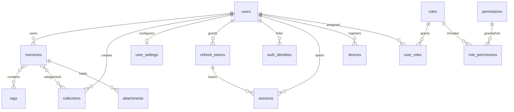

# MEMORA Backend Requirements

## 1. Document Overview

### Purpose
This document outlines the backend architectural design, database domain models, API specifications, and route requirements for **Memora**, a personal memory and knowledge capture platform. It serves as a comprehensive implementation guide for backend developers to build an API service that aligns exactly with the existing Chrome Extension, Mobile (Expo) App, and Web Client frontend architectures.

### Scope
The scope covers:
- User Authentication (including local and social login)
- Memory ingestion and management (URLs, notes, screenshots, files, and voice recordings)
- Automated AI operations (web scraping, summarization, speech-to-text, and semantic indexing)
- Organization systems (collections, tag associations, and trash/archive states)
- Search capabilities (keyword query and semantic/RAG-driven chatbot conversation)
- Account management (settings preference persistence and connected integrations)

### Source of Truth
Frontend code bases and configuration files in the workspace:
1. **Chrome Extension** (`/extension`): Vite + React + TypeScript extension (V3 manifest).
2. **Mobile Application** (`/mobile`): Expo + React Native + Expo Router + TypeScript mobile interface.
3. **Web Client** (`/client`): Next.js + React + TypeScript dashboard portal.

**Date of Analysis:** August 25, 2026  
**Status:** Approved for Backend Implementation

### Assumptions and Limitations
- The backend runs on `http://localhost:4000` in local development (the actual default `PORT` in `server/src/config/env.ts`), reachable at `http://localhost:4000/api/v1`. **Note:** the Chrome Extension's popup and background worker currently disagree with each other on this — `Popup.tsx` targets `https://api.memora.io/api/memories` while `service-worker.ts` targets `http://localhost:3000/api/memories`, and neither includes the `/v1` prefix. Both should be updated to point at `http://localhost:4000/api/v1/memories` for local development.
- AI operations (summarization, speech-to-text, embeddings) are assumed to run asynchronously or via direct API calls during capture, without blocking frontend UI interactions.
- The web client uses `localStorage` (key: `memora_token` or `token`) which is accessed by the extension content script when visiting authorized domains.
- **Authentication is a custom, hand-rolled implementation** — JWT access/refresh tokens signed and verified in-house, with `bcrypt` for password hashing. See Section 6 for details. This requires adding `jsonwebtoken` and `bcrypt` (not currently installed) to `server/package.json`, and adding a `password_hash` column back to the `users` table (Section 5, table 1) — neither exists yet in `server/src/db/schema.ts`. The `BETTER_AUTH_SECRET` env var in `server/src/config/env.ts` is a leftover from an earlier direction and should be renamed to `JWT_ACCESS_SECRET`/`JWT_REFRESH_SECRET` (or similar) once custom auth is implemented.
- Mobile's voice capture (`mobile/app/voice-capture.tsx`) is currently fully simulated — it has no microphone/recording dependency and never produces a real audio file. `POST /ai/process-voice` (which expects an `audio_url` from a prior upload) therefore has no real client producer yet; treat it as a documented target, not something with an active caller today.

---

## 2. Product Overview

Memora is a "second brain" platform designed to collect, process, search, and rediscover information. It captures digital content across platforms and devices, instantly consolidating knowledge.

### Major Use Cases
- **Capture:** Instantly ingest URLs, page metadata, selections, images, documents, manually typed thoughts, or voice recordings.
- **Organize:** Group captures into folders (Collections) and assign badges (Tags). The backend automatically extracts metadata, transcripts, and tags using AI.
- **Search:** Retrieve items via text keyword search or filter by memory capture types (links, notes, videos, images, files).
- **Discover:** Re-surface older, forgotten captures ("Forgotten Gems") that correlate with current topics.
- **AI Memory:** Interact with a RAG chat interface ("Ask Memora") that answers queries based on the user's historical notes and links.
- **Cross-device Access:** Keep data synchronized across the Chrome extension, mobile app, and Next.js web application.

---

## 3. Frontend Architecture Summary

### Chrome Extension Architecture
- **Popup (`Popup.tsx`):** Reads the current active browser tab (URL, Title, Favicon). Simulates a duplication check. If valid, performs an automatic save. Allows subsequent updates to tags, collection folders, and custom notes.
- **Background Worker (`service-worker.ts`):** Context menu options ("Save page", "Save selected text", "Save image") and keyboard shortcuts (`quick-save-page`) invoke background `fetch` calls carrying user JWT tokens. Displays browser notifications upon success.
- **Content Script (`content-script.ts`):** Automatically reads active token storage from `localhost`/`memora.io` pages, synchronizing authentication state into `chrome.storage.local`. Injects scraping listeners for metadata fields (`description`, `og:image`, `keywords`).

### Mobile Architecture (React Native / Expo)
- **State Management (`MemoryContext.tsx`):** Exposes state contexts (`memories`), and actions (`addMemory`, `deleteMemory`, `toggleFavorite`).
- **Capture Hooks:** Handled via bottom sheet menus (`capture.tsx`) redirecting to specific capture views:
  - `quick-note.tsx`: Text notes saving first line as title.
  - `voice-capture.tsx`: Records audio clips and shows processing state while transcribing.
  - `share-confirm.tsx`: Native share target callback, saving title/source/tags and enabling optional notes.
- **Navigation:** Controlled by `expo-router` using file-based routes (Tabs layout, Stack modal views).

### Web Client Architecture (Next.js)
- **Core Views:**
  - `/app/memories`: Main timeline feed containing filter pills (Links, Notes, Videos, Images, Files) and layout toggles.
  - `/app/collections`: Directory folders listing items.
  - `/app/explore`: Rediscovering cards.
  - `/app/graph`: Interactive SVG connecting semantic tags as nodes.
  - `/app/insights`: Render bars representing user topic trends and AI text summaries.
- **State:** Utilizes local react states (`initialMemories`) for UI mockups, expecting direct REST API replacement.

---

## 4. Backend Responsibilities

### MVP Core Responsibilities
- **Authentication System:** Registration, logins (credential verification), secure session issuance (access + refresh tokens), and social login callback stubs.
- **Memory Management:** CRUD storage for all memory entries, handling custom notes, favorite toggles, soft deletes (Trash), and archive states.
- **Metadata Scraping:** For link memory ingestion, the backend must scrape target URLs to parse page title, description, favicon, and OG previews if missing from request payload.
- **Organization Hierarchy:** Manage folder Collections and system/user Tag records.

### AI & Media Processing Responsibilities
- **Speech-to-Text Transcriber:** Accept binary audio uploads (from voice captures) and transcribe them to text.
- **Concept Summarization & Tag Extraction:** Analyze notes and link descriptions to generate summaries and automatically suggest tags.
- **Semantic Vector Indexing:** Map captures to database vector embeddings (e.g. using `pgvector` or similar) to power AI queries and relational matching.
- **Semantic Search & Chat Engine (RAG):** Power the "Ask Memora" chat page by retrieving memory context and feeding it into an LLM context window to answer questions.
- **Relational Similarity Mapping:** Calculate cosine distances between embeddings to supply "Related Memories".

---

## 5. Domain Model

The relational database diagram model comprises the following entities (matches `server/src/db/schema.ts` for the auth/user portion; the memory-capture portion is not yet built):



### Database Tables and Fields

> Tables 1–8 below (the auth/RBAC layer) already exist in `server/src/db/schema.ts`, **except** `users.password_hash` (table 1), which needs to be added now that auth is custom rather than better-auth. Tables 9–16 (the memory-capture layer) do not exist yet — no `memories`/`collections`/`tags`/`attachments`/`user_settings` module or table has been created.

### 1. `users`
Represents user credentials and profiles. Password hashing is handled in-house with `bcrypt` — `password_hash` is nullable for OAuth-only accounts (see `auth_identities`, table 2).

| Field | Type | Required | Default | Constraints | Description |
|---|---|---|---|---|---|
| `id` | UUID | Yes | `gen_random_uuid()` | Primary Key | Unique user identifier |
| `email` | VARCHAR(255) | Yes | None | Unique | User login email |
| `password_hash` | VARCHAR(255) | No | None | | bcrypt hash; null for OAuth-only accounts. **Not yet present in `server/src/db/schema.ts` — needs to be added.** |
| `name` | VARCHAR(255) | No | None | | Display name |
| `avatar_url` | TEXT | No | Null | | URL to user profile picture |
| `status` | ENUM | Yes | `active` | `active`, `inactive`, `banned`, `suspended`, `deleted` | Account status |
| `email_verified` | BOOLEAN | Yes | `false` | | Verification state |
| `email_verified_at` | TIMESTAMPTZ | No | Null | | Verification timestamp |
| `created_at` | TIMESTAMPTZ | Yes | `NOW()` | | Record creation timestamp |
| `updated_at` | TIMESTAMPTZ | Yes | `NOW()` | | Last record update |

### 2. `auth_identities`
Links a user to an OAuth provider identity (Google/GitHub), for users who sign in via social login instead of (or in addition to) `users.password_hash`.

| Field | Type | Required | Default | Constraints | Description |
|---|---|---|---|---|---|
| `id` | UUID | Yes | `gen_random_uuid()` | Primary Key | Unique identity identifier |
| `user_id` | UUID | Yes | None | Foreign Key (`users.id`) ON DELETE CASCADE | Owning user |
| `provider` | ENUM | Yes | None | `google`, `github` | OAuth provider |
| `provider_id` | VARCHAR(255) | Yes | None | Unique with `provider` | Provider-side account id |
| `provider_data` | JSONB | Yes | `{}` | | Raw provider profile payload |
| `created_at` | TIMESTAMPTZ | Yes | `NOW()` | | Creation timestamp |
| `updated_at` | TIMESTAMPTZ | Yes | `NOW()` | | Last update timestamp |

### 3. `roles`
Dynamic role definitions (e.g. `free_user`, `pro_user`, `admin`) rather than a fixed enum, so new tiers/roles can be added without a migration.

| Field | Type | Required | Default | Constraints | Description |
|---|---|---|---|---|---|
| `id` | UUID | Yes | `gen_random_uuid()` | Primary Key | Unique role identifier |
| `name` | VARCHAR(100) | Yes | None | Unique | Role slug, e.g. `free_user` |
| `description` | TEXT | No | Null | | Human-readable description |
| `is_system` | BOOLEAN | Yes | `false` | | Protects core roles from deletion |
| `created_at` | TIMESTAMPTZ | Yes | `NOW()` | | Creation timestamp |
| `updated_at` | TIMESTAMPTZ | Yes | `NOW()` | | Last update timestamp |

### 4. `permissions`
Granular capability flags (e.g. `bookmarks:export`, `ai:summarize`, `billing:manage`) attached to roles.

| Field | Type | Required | Default | Constraints | Description |
|---|---|---|---|---|---|
| `id` | UUID | Yes | `gen_random_uuid()` | Primary Key | Unique permission identifier |
| `name` | VARCHAR(100) | Yes | None | Unique | Permission slug |
| `description` | TEXT | No | Null | | Human-readable description |
| `category` | VARCHAR(100) | No | Null | e.g. `ai`, `bookmarks`, `billing`, `admin` | Grouping for admin UI |
| `created_at` | TIMESTAMPTZ | Yes | `NOW()` | | Creation timestamp |
| `updated_at` | TIMESTAMPTZ | Yes | `NOW()` | | Last update timestamp |

### 5. `role_permissions`
Many-to-many mapping between roles and permissions.

| Field | Type | Required | Default | Constraints | Description |
|---|---|---|---|---|---|
| `id` | UUID | Yes | `gen_random_uuid()` | Primary Key | Unique row identifier |
| `role_id` | UUID | Yes | None | Foreign Key (`roles.id`) ON DELETE CASCADE | Target role |
| `permission_id` | UUID | Yes | None | Foreign Key (`permissions.id`) ON DELETE CASCADE | Granted permission |
| `created_at` | TIMESTAMPTZ | Yes | `NOW()` | | Grant timestamp |

*Note: Unique constraint on (`role_id`, `permission_id`).*

### 6. `user_roles`
Assigns one or more dynamic roles to a user.

| Field | Type | Required | Default | Constraints | Description |
|---|---|---|---|---|---|
| `id` | UUID | Yes | `gen_random_uuid()` | Primary Key | Unique row identifier |
| `user_id` | UUID | Yes | None | Foreign Key (`users.id`) ON DELETE CASCADE | Target user |
| `role_id` | UUID | Yes | None | Foreign Key (`roles.id`) ON DELETE CASCADE | Assigned role |
| `assigned_by` | UUID | No | Null | Foreign Key (`users.id`) ON DELETE SET NULL | Admin/user who granted the role |
| `assigned_at` | TIMESTAMPTZ | Yes | `NOW()` | | Assignment timestamp |

*Note: Unique constraint on (`user_id`, `role_id`).*

### 7. `refresh_tokens`
Handles authorization sessions.

| Field | Type | Required | Default | Constraints | Description |
|---|---|---|---|---|---|
| `id` | UUID | Yes | `gen_random_uuid()` | Primary Key | Unique token identifier |
| `user_id` | UUID | Yes | None | Foreign Key (`users.id`) ON DELETE CASCADE | Target user |
| `token` | TEXT | Yes | None | Unique | Secure refresh token hash |
| `expires_at` | TIMESTAMPTZ | Yes | None | | Expiry boundary |
| `revoked` | BOOLEAN | Yes | `false` | | Set true on logout/rotation |
| `ip_address` | VARCHAR(45) | No | Null | | Issuing client IP |
| `created_at` | TIMESTAMPTZ | Yes | `NOW()` | | Issuance timestamp |
| `updated_at` | TIMESTAMPTZ | Yes | `NOW()` | | Last update timestamp |

### 8. `sessions` and `devices`
Tracks active logged-in sessions and the physical/browser devices they originate from, enabling multi-device session management (e.g. a future "Connected devices" settings page).

**`sessions`**

| Field | Type | Required | Default | Constraints | Description |
|---|---|---|---|---|---|
| `id` | UUID | Yes | `gen_random_uuid()` | Primary Key | Unique session identifier |
| `user_id` | UUID | Yes | None | Foreign Key (`users.id`) ON DELETE CASCADE | Owning user |
| `refresh_token_id` | UUID | No | Null | Foreign Key (`refresh_tokens.id`) ON DELETE CASCADE | Backing refresh token |
| `device_id` | VARCHAR(255) | No | Null | | Correlates to `devices.device_fingerprint` |
| `ip_address` | VARCHAR(45) | No | Null | | Client IP at last activity |
| `user_agent` | TEXT | No | Null | | Raw user-agent string |
| `last_activity_at` | TIMESTAMPTZ | Yes | `NOW()` | | Last request timestamp |
| `created_at` | TIMESTAMPTZ | Yes | `NOW()` | | Session start |
| `updated_at` | TIMESTAMPTZ | Yes | `NOW()` | | Last update |

**`devices`**

| Field | Type | Required | Default | Constraints | Description |
|---|---|---|---|---|---|
| `id` | UUID | Yes | `gen_random_uuid()` | Primary Key | Unique device identifier |
| `user_id` | UUID | Yes | None | Foreign Key (`users.id`) ON DELETE CASCADE | Owning user |
| `device_fingerprint` | VARCHAR(255) | Yes | None | Unique with `user_id` | Stable client fingerprint |
| `device_name` | VARCHAR(255) | No | Null | | e.g. "Subham's MacBook" |
| `platform` | VARCHAR(100) | No | Null | | OS platform |
| `browser` | VARCHAR(100) | No | Null | | Browser identifier |
| `device_type` | VARCHAR(100) | No | Null | | e.g. `desktop`, `mobile`, `extension` |
| `ip_address` | VARCHAR(45) | No | Null | | Last known IP |
| `last_used_at` | TIMESTAMPTZ | Yes | `NOW()` | | Last activity |
| `created_at` | TIMESTAMPTZ | Yes | `NOW()` | | Registration timestamp |
| `updated_at` | TIMESTAMPTZ | Yes | `NOW()` | | Last update |

### 9. `memories`
Stores captured items (web link, note, video, image, document, voice).

| Field | Type | Required | Default | Constraints | Description |
|---|---|---|---|---|---|
| `id` | UUID | Yes | `gen_random_uuid()` | Primary Key | Unique memory identifier |
| `user_id` | UUID | Yes | None | Foreign Key (`users.id`) ON DELETE CASCADE | Owner identity |
| `type` | VARCHAR(20) | Yes | None | Enum: `web`, `video`, `note`, `image`, `document`, `voice` | Capture medium |
| `title` | TEXT | Yes | "Untitled" | | Display title |
| `url` | TEXT | No | Null | | Scraped URL |
| `content` | TEXT | No | Null | | Raw text details / note body / transcript |
| `description` | TEXT | No | Null | | AI generated summary / extracted paragraph |
| `source` | VARCHAR(100) | Yes | None | e.g. `linear.app`, `YouTube`, `Personal Note` | Domain origin label |
| `favicon_url` | TEXT | No | Null | | Site favicon, scraped or supplied by the extension |
| `preview_image_url` | TEXT | No | Null | | `og:image`, scraped or supplied by the extension |
| `keywords` | TEXT[] | No | Null | | `meta[name=keywords]`, scraped by the extension content script |
| `is_favorite` | BOOLEAN | Yes | `false` | | Star status toggle |
| `is_archived` | BOOLEAN | Yes | `false` | | Archive state toggle |
| `in_trash` | BOOLEAN | Yes | `false` | | Soft delete state toggle |
| `created_at` | TIMESTAMPTZ | Yes | `NOW()` | | Creation timestamp |
| `updated_at` | TIMESTAMPTZ | Yes | `NOW()` | | Last update timestamp |

> `favicon_url`/`preview_image_url`/`keywords` are new fields added to reflect what `extension/src/content/content-script.ts` already scrapes (`description`, `og:image`, `keywords`) but the extension's `Popup.tsx` currently discards `previewImage`/`keywords` after fetching them (only `description` is read from the `GET_METADATA` response) — once these fields exist here, the popup should be updated to pass all three through.

### 10. `collections`
Represents folder partitions.

| Field | Type | Required | Default | Constraints | Description |
|---|---|---|---|---|---|
| `id` | UUID | Yes | `gen_random_uuid()` | Primary Key | Unique collection identifier |
| `user_id` | UUID | Yes | None | Foreign Key (`users.id`) ON DELETE CASCADE | Creator reference |
| `name` | VARCHAR(100) | Yes | None | | Folder title |
| `icon` | VARCHAR(50) | Yes | "folder-outline"| Lucide/Ionicons string identifier | Display icon name |
| `description` | TEXT | No | Null | | Brief purpose of folder |
| `created_at` | TIMESTAMPTZ | Yes | `NOW()` | | Creation timestamp |
| `updated_at` | TIMESTAMPTZ | Yes | `NOW()` | | Last update timestamp |

### 11. `collection_memories`
Categorizes memories into folder collections (many-to-many relationship).

| Field | Type | Required | Constraints | Description |
|---|---|---|---|---|
| `collection_id` | UUID | Yes | Foreign Key (`collections.id`) ON DELETE CASCADE | Target collection |
| `memory_id` | UUID | Yes | Foreign Key (`memories.id`) ON DELETE CASCADE | Target memory |

*Note: Composite Primary Key: (`collection_id`, `memory_id`)*

### 12. `tags`
Unique badges.

| Field | Type | Required | Default | Constraints | Description |
|---|---|---|---|---|---|
| `id` | UUID | Yes | `gen_random_uuid()` | Primary Key | Unique tag identifier |
| `name` | VARCHAR(50) | Yes | None | Unique | Case-insensitive badge text |

### 13. `memory_tags`
Maps memories to tags.

| Field | Type | Required | Constraints | Description |
|---|---|---|---|---|
| `memory_id` | UUID | Yes | Foreign Key (`memories.id`) ON DELETE CASCADE | Target memory |
| `tag_id` | UUID | Yes | Foreign Key (`tags.id`) ON DELETE CASCADE | Applied tag |

*Note: Composite Primary Key: (`memory_id`, `tag_id`)*

### 14. `attachments`
Binary assets associated with a memory (uploaded documents, images, voice clips).

| Field | Type | Required | Default | Constraints | Description |
|---|---|---|---|---|---|
| `id` | UUID | Yes | `gen_random_uuid()` | Primary Key | Unique identifier |
| `memory_id` | UUID | Yes | None | Foreign Key (`memories.id`) ON DELETE CASCADE | Parent memory |
| `file_url` | TEXT | Yes | None | | Cloud/local filesystem address |
| `file_size` | INT | No | Null | | Byte size |
| `mime_type` | VARCHAR(100) | No | Null | | Media standard type |
| `created_at` | TIMESTAMPTZ | Yes | `NOW()` | | Upload timestamp |

### 15. `user_settings`
User-specific preferences. Expanded from the original flat 3-toggle design to match the granularity actually built across `client/app/(platfrom)/app/settings/{ai,capture,notifications,appearance}/page.tsx`.

| Field | Type | Required | Default | Constraints | Description |
|---|---|---|---|---|---|
| `user_id` | UUID | Yes | None | Primary Key, Foreign Key (`users.id`) ON DELETE CASCADE | Owner link |
| `ai_auto_organization` | BOOLEAN | Yes | `true` | | Sort incoming captures into folders automatically |
| `ai_summaries` | BOOLEAN | Yes | `true` | | Generate AI summaries for captures |
| `ai_related_memories` | BOOLEAN | Yes | `true` | | Show related-memory similarity mapping |
| `ai_semantic_search` | BOOLEAN | Yes | `true` | | Enable semantic (not just keyword) search |
| `ai_ask_memora` | BOOLEAN | Yes | `true` | | Enable the "Ask Memora" RAG chatbot |
| `capture_extract_content` | BOOLEAN | Yes | `true` | | Auto-fetch full page body text on URL capture |
| `capture_generate_title` | BOOLEAN | Yes | `true` | | Use AI to clean/generate page titles |
| `capture_generate_summary` | BOOLEAN | Yes | `true` | | Auto-generate a capture summary |
| `capture_suggest_tags` | BOOLEAN | Yes | `true` | | Auto-suggest tags on capture |
| `default_collection_id` | UUID | No | Null | Foreign Key (`collections.id`) ON DELETE SET NULL | Default folder for new captures ("Inbox" when null) |
| `notify_weekly_summary` | BOOLEAN | Yes | `true` | | Weekly digest email |
| `notify_forgotten_memories` | BOOLEAN | Yes | `true` | | "Forgotten Gems" rediscovery alerts |
| `notify_product_updates` | BOOLEAN | Yes | `false` | | Product news/announcements |
| `theme` | VARCHAR(20) | Yes | `"system"` | Enum: `system`, `light`, `dark` | Appearance preference |
| `accent_color` | VARCHAR(20) | Yes | `"blue"` | Enum: `blue`, `purple`, `green`, `orange` | Accent color (currently only `blue` is functionally wired in the UI — the others update the selection state but not the live theme, per `client/app/(platfrom)/app/settings/appearance/page.tsx`) |

### 16. `connected_accounts` (derived, not a table)
`GET /settings` also returns a `connected_accounts` object (`{google: boolean, github: boolean}`) reflecting whether the user has a corresponding row in `auth_identities` for that `provider` — this is a computed projection at read time, not a stored column.

---

## 6. Authentication

### Mechanics
- **Custom, hand-rolled implementation** — no third-party auth library (better-auth, Passport, etc.). Requires adding `jsonwebtoken` and `bcrypt` to `server/package.json` (neither is installed yet).
- **Password hashing:** `bcrypt` (cost factor 10–12) hashes stored in `users.password_hash` (Section 5, table 1 — column needs to be added to `server/src/db/schema.ts`).
- **JWT tokens:** Short-lived access tokens (expiration: 15 minutes) signed with `JWT_ACCESS_SECRET`, and longer-lived refresh tokens (expiration: 7 days) signed with `JWT_REFRESH_SECRET` and persisted server-side in `refresh_tokens` (Section 5, table 7) so they can be revoked. These two env vars should replace `BETTER_AUTH_SECRET` in `server/src/config/env.ts`.
- **Access token placement:** Checked in request Headers: `Authorization: Bearer <JWT_ACCESS_TOKEN>`.
- **Refresh flow:** `POST /auth/refresh` verifies the refresh token against the `refresh_tokens` table (checking `revoked`/`expires_at`), issues a new access token, and rotates the refresh token (marks the old row `revoked = true`, inserts a new row). `sessions` (Section 5, table 8) additionally tracks per-device/browser activity for a future "active sessions" settings view, keyed to the backing `refresh_tokens` row.
- **Extension Sync:** Extension checks for the presence of the client token in Chrome local storage. The background script checks credentials and uses the token to authenticate its API calls.
- **Social OAuth:** Google and GitHub sign-in are modeled via the `auth_identities` table (Section 5, table 2) — one row per linked provider account, keyed by `(provider, provider_id)`. The backend implements the OAuth callback exchange itself (verify provider code → fetch profile → upsert `users`/`auth_identities` → issue our own JWT pair); no third-party auth library handles this step. `GOOGLE_CLIENT_ID`/`GOOGLE_CLIENT_SECRET`/`GITHUB_CLIENT_ID`/`GITHUB_CLIENT_SECRET` env vars need to be added to `env.ts`.
- **Authorization (RBAC):** Beyond authentication, access control is governed by the `roles` → `role_permissions` → `permissions` chain, with users assigned roles via `user_roles` (Section 5, tables 3–6). This replaces any flat "role" string on the user; a user's effective permissions are the union of permissions across all roles assigned to them.

---

## 7. API Conventions

- **Base URL:** `/api/v1`
- **Date Format:** ISO 8601 UTC timestamp format: `YYYY-MM-DDTHH:mm:ss.sssZ` (e.g., `2026-08-25T15:30:00.000Z`).
- **Response Format:** Uniform JSON wrapper template.
  
#### Success Template
```json
{
  "success": true,
  "data": {},
  "meta": {},
  "error": null
}
```
*Note: For collection lists, `"data"` is an array of objects. Pagination data goes in `"meta"`.*

#### Error Template
```json
{
  "success": false,
  "data": null,
  "meta": {},
  "error": {
    "code": "BAD_REQUEST",
    "message": "Detailed developer error context description",
    "details": {}
  }
}
```

---

## 8. Complete API Route Catalog

### Authentication Services

> Custom JWT implementation — `password_hash` is hashed with `bcrypt`; access/refresh tokens are signed and verified by our own code (no third-party auth library). `name` matches the actual `users` table field (Section 5, table 1); pre-existing docs used `full_name`, which has been corrected here to match `server/src/db/schema.ts`.

#### `POST /api/v1/auth/register`
- **Purpose:** Register a new user account with email + password. Hashes the password with `bcrypt` before storing.
- **Used by:** Web Client, Mobile.
- **Auth required:** No.
- **Request Body:**
  ```json
  {
    "email": "subham@memora.io",
    "password": "Password123",
    "name": "Subham Jyoti"
  }
  ```
- **Success Response (201 Created):**
  ```json
  {
    "success": true,
    "data": {
      "user": {
        "id": "c0017c60-8bb0-47b8-b4b1-8b27f1c1a2f6",
        "email": "subham@memora.io",
        "name": "Subham Jyoti",
        "avatar_url": null,
        "status": "active",
        "email_verified": false
      },
      "tokens": {
        "accessToken": "eyJhbGciOiJIUzI1NiIsInR5cCI6IkpXVCJ9...",
        "refreshToken": "eyJhbGciOiJIUzI1NiIsInR5cCI6IkpXVCJ9..."
      }
    },
    "meta": {},
    "error": null
  }
  ```

#### `POST /api/v1/auth/login`
- **Purpose:** Authenticate email/password credentials against `password_hash` via `bcrypt.compare`, then issue a JWT access/refresh pair.
- **Used by:** Web Client, Mobile.
- **Auth required:** No.
- **Request Body:**
  ```json
  {
    "email": "subham@memora.io",
    "password": "Password123"
  }
  ```
- **Success Response (200 OK):**
  ```json
  {
    "success": true,
    "data": {
      "user": {
        "id": "c0017c60-8bb0-47b8-b4b1-8b27f1c1a2f6",
        "email": "subham@memora.io",
        "name": "Subham Jyoti",
        "avatar_url": "https://api.memora.io/uploads/avatars/sj.png",
        "status": "active"
      },
      "tokens": {
        "accessToken": "eyJhbGciOiJIUzI1NiIsInR5cCI6IkpXVCJ9...",
        "refreshToken": "eyJhbGciOiJIUzI1NiIsInR5cCI6IkpXVCJ9..."
      }
    },
    "meta": {},
    "error": null
  }
  ```

#### `POST /api/v1/auth/refresh`
- **Purpose:** Exchange a valid, non-revoked refresh token (checked against the `refresh_tokens` table) for a new access token, rotating the refresh token in the process.
- **Used by:** Web Client, Mobile, Extension.
- **Auth required:** No.
- **Request Body:**
  ```json
  {
    "refreshToken": "eyJhbGciOiJIUzI1NiIsInR5cCI6IkpXVCJ9..."
  }
  ```
- **Success Response (200 OK):**
  ```json
  {
    "success": true,
    "data": {
      "tokens": {
        "accessToken": "eyJhbGciOiJIUzI1NiIsInR5cCI6IkpXVCJ9...",
        "refreshToken": "eyJhbGciOiJIUzI1NiIsInR5cCI6IkpXVCJ9..."
      }
    },
    "meta": {},
    "error": null
  }
  ```

#### `POST /api/v1/auth/logout`
- **Purpose:** Mark the presented refresh token's row `revoked = true`, invalidating that session.
- **Used by:** Web Client, Mobile, Extension.
- **Auth required:** Yes.
- **Request Body:**
  ```json
  {
    "refreshToken": "eyJhbGciOiJIUzI1NiIsInR5cCI6IkpXVCJ9..."
  }
  ```
- **Success Response (200 OK):**
  ```json
  {
    "success": true,
    "data": {
      "message": "Logged out successfully"
    },
    "meta": {},
    "error": null
  }
  ```

#### `GET /api/v1/auth/me`
- **Purpose:** Retrieve the profile details of the currently authenticated user, resolved from the verified JWT access token's subject claim.
- **Used by:** Web Client, Mobile, Extension.
- **Auth required:** Yes.
- **Success Response (200 OK):**
  ```json
  {
    "success": true,
    "data": {
      "user": {
        "id": "c0017c60-8bb0-47b8-b4b1-8b27f1c1a2f6",
        "email": "subham@memora.io",
        "name": "Subham Jyoti",
        "avatar_url": "https://api.memora.io/uploads/avatars/sj.png",
        "status": "active",
        "roles": ["free_user"]
      }
    },
    "meta": {},
    "error": null
  }
  ```

---

### Memory Management Services

#### `GET /api/v1/memories`
- **Purpose:** Retrieve a timeline of saved memories, with support for filtering, search, and pagination.
- **Used by:** Web Client, Mobile.
- **Auth required:** Yes.
- **Query Parameters:**
  - `type`: Filter by media (`web`, `video`, `note`, `image`, `document`, `voice`).
  - `is_favorite`: Filter starred items (`true` / `false`).
  - `is_archived`: Filter archived items (`true` / `false`).
  - `in_trash`: Filter soft-deleted items (`true` / `false`).
  - `collection_id`: Filter by collection folder.
  - `tag`: Filter by tag name.
  - `q`: Text keyword search query.
  - `page`: Page index (default: `1`).
  - `limit`: Items per page (default: `20`).
- **Success Response (200 OK):**
  ```json
  {
    "success": true,
    "data": [
      {
        "id": "mem-1",
        "type": "web",
        "title": "Linear Dashboard",
        "url": "https://linear.app/features",
        "content": null,
        "description": "SaaS Dashboard inspiration. Clean sidebar navigation, custom dark colors.",
        "source": "linear.app",
        "is_favorite": true,
        "is_archived": false,
        "in_trash": false,
        "tags": ["Design", "SaaS"],
        "created_at": "2026-08-25T18:56:18.000Z",
        "updated_at": "2026-08-25T18:56:18.000Z"
      }
    ],
    "meta": {
      "page": 1,
      "limit": 20,
      "total_items": 248,
      "total_pages": 13
    },
    "error": null
  }
  ```

#### `POST /api/v1/memories`
- **Purpose:** Create a new memory. If a URL is provided, the backend crawls the page and extracts metadata (falling back to whatever the client already scraped, if provided).
- **Used by:** Web Client, Mobile, Chrome Extension.
- **Auth required:** Yes.
- **`type` values:** `web`, `video`, `note`, `image`, `document`, `voice`. **Note:** `extension/src/background/service-worker.ts` currently sends `type: "link"` for its context-menu/keyboard-shortcut saves — this is not a valid value and needs to be changed to `"web"` to match this contract before the extension is wired to a real backend.
- **Request Body (JSON):**
  ```json
  {
    "type": "web",
    "url": "https://linear.app/features",
    "title": "Linear Dashboard",
    "content": "Additional custom notes written by the user at capture time.",
    "favicon_url": "https://linear.app/favicon.ico",
    "preview_image_url": "https://linear.app/og-image.png",
    "keywords": ["issue tracking", "project management"],
    "collection_ids": ["c40f5a70-8b1b-4170-a15d-007a9e1e12e1"],
    "tags": ["Design", "SaaS"]
  }
  ```
  *`favicon_url`, `preview_image_url`, and `keywords` are optional — they're populated by the Chrome Extension's `content-script.ts` scraping (og:image/keywords/favicon) and by the web client's own metadata fetch; the mobile app currently never supplies them.*
- **Success Response (210 Auto-Scraped / 201 Created):**
  ```json
  {
    "success": true,
    "data": {
      "id": "mem-1",
      "type": "web",
      "title": "Linear Dashboard",
      "url": "https://linear.app/features",
      "content": "Additional custom notes written by the user at capture time.",
      "description": "Scraped description: Issue tracking tool built for high-performance software teams.",
      "source": "linear.app",
      "favicon_url": "https://linear.app/favicon.ico",
      "preview_image_url": "https://linear.app/og-image.png",
      "keywords": ["issue tracking", "project management"],
      "is_favorite": false,
      "is_archived": false,
      "in_trash": false,
      "tags": ["Design", "SaaS", "Productivity"],
      "created_at": "2026-08-25T20:56:18.000Z",
      "updated_at": "2026-08-25T20:56:18.000Z"
    },
    "meta": {},
    "error": null
  }
  ```

#### `POST /api/v1/memories/check-duplicate`
- **Purpose:** Check if a URL is already saved. Helps the extension show the "Already Saved" state.
- **Used by:** Chrome Extension, Mobile.
- **Auth required:** Yes.
- **Request Body:**
  ```json
  {
    "url": "https://linear.app/features"
  }
  ```
- **Success Response (200 OK - Duplicate Found):**
  ```json
  {
    "success": true,
    "data": {
      "is_duplicate": true,
      "memory": {
        "id": "mem-1",
        "title": "Linear Dashboard",
        "source": "linear.app",
        "created_at": "2026-05-15T10:14:00.000Z",
        "time_ago": "3 months ago"
      }
    },
    "meta": {},
    "error": null
  }
  ```
- **Success Response (200 OK - No Duplicate):**
  ```json
  {
    "success": true,
    "data": {
      "is_duplicate": false,
      "memory": null
    },
    "meta": {},
    "error": null
  }
  ```

#### `GET /api/v1/memories/:id`
- **Purpose:** Retrieve details for a specific memory.
- **Used by:** Web Client, Mobile.
- **Auth required:** Yes.
- **Success Response (200 OK):**
  ```json
  {
    "success": true,
    "data": {
      "id": "mem-1",
      "type": "web",
      "title": "Linear Dashboard",
      "url": "https://linear.app/features",
      "content": "User notes here",
      "description": "AI analysis summary detail paragraph description.",
      "source": "linear.app",
      "is_favorite": true,
      "is_archived": false,
      "in_trash": false,
      "tags": ["Design", "SaaS"],
      "collections": [
        { "id": "col-12", "name": "Design Inspiration" }
      ],
      "attachments": [],
      "created_at": "2026-08-25T20:56:18.000Z",
      "updated_at": "2026-08-25T20:58:00.000Z"
    },
    "meta": {},
    "error": null
  }
  ```

#### `PATCH /api/v1/memories/:id`
- **Purpose:** Update fields of a specific memory (e.g., editing notes, toggling favorites, archiving, or moving to trash).
- **Used by:** Web Client, Mobile, Chrome Extension.
- **Auth required:** Yes.
- **Request Body (supports partial updates):**
  ```json
  {
    "title": "Updated Title",
    "content": "Updated custom notes description text.",
    "is_favorite": true,
    "is_archived": false,
    "in_trash": false,
    "collection_ids": ["col-12"],
    "tags": ["Design", "SaaS", "Inspiration"]
  }
  ```
- **Success Response (200 OK):**
  ```json
  {
    "success": true,
    "data": {
      "id": "mem-1",
      "type": "web",
      "title": "Updated Title",
      "url": "https://linear.app/features",
      "content": "Updated custom notes description text.",
      "description": "AI analysis summary detail paragraph description.",
      "source": "linear.app",
      "is_favorite": true,
      "is_archived": false,
      "in_trash": false,
      "tags": ["Design", "SaaS", "Inspiration"],
      "created_at": "2026-08-25T20:56:18.000Z",
      "updated_at": "2026-08-25T21:00:00.000Z"
    },
    "meta": {},
    "error": null
  }
  ```

#### `DELETE /api/v1/memories/:id`
- **Purpose:** Permanently delete a memory and its attachments. (For soft deletion, use `PATCH` with `in_trash: true`).
- **Used by:** Web Client, Mobile.
- **Auth required:** Yes.
- **Success Response (200 OK):**
  ```json
  {
    "success": true,
    "data": {
      "message": "Memory permanently deleted successfully",
      "id": "mem-1"
    },
    "meta": {},
    "error": null
  }
  ```

#### `GET /api/v1/memories/:id/related`
- **Purpose:** Retrieve semantically related memories.
- **Used by:** Web Client, Mobile.
- **Auth required:** Yes.
- **Success Response (200 OK):**
  ```json
  {
    "success": true,
    "data": [
      {
        "id": "mem-4",
        "title": "SaaS Pricing UI Reference",
        "desc": "Screenshot showing clean card grids and pricing structures.",
        "similarity": 0.89
      },
      {
        "id": "mem-12",
        "title": "Stripe Checkout CSS Configs",
        "desc": "Gradient configurations on checkout pages.",
        "similarity": 0.81
      }
    ],
    "meta": {},
    "error": null
  }
  ```

#### `GET /api/v1/memories/explore`
- **Purpose:** Surface forgotten memory cards ("Forgotten Gems") for rediscovery.
- **Used by:** Web Client.
- **Auth required:** Yes.
- **Success Response (200 OK):**
  ```json
  {
    "success": true,
    "data": [
      {
        "id": "mem-99",
        "title": "SaaS Onboarding UX layout",
        "source": "Captured 6 months ago &middot; 4 similar updates found",
        "href": "/app/memories/mem-99"
      },
      {
        "id": "mem-150",
        "title": "PostgreSQL B-Tree Indexes Tuning",
        "source": "Captured a year ago today &middot; 2 related saves",
        "href": "/app/memories/mem-150"
      }
    ],
    "meta": {},
    "error": null
  }
  ```

---

### Collection Folder Services

#### `GET /api/v1/collections`
- **Purpose:** List the user's collections with memory counts for each.
- **Used by:** Web Client, Mobile.
- **Auth required:** Yes.
- **Success Response (200 OK):**
  ```json
  {
    "success": true,
    "data": [
      {
        "id": "col-1",
        "name": "Design",
        "icon": "color-palette-outline",
        "memory_count": 42
      },
      {
        "id": "col-2",
        "name": "Development",
        "icon": "code-slash-outline",
        "memory_count": 37
      }
    ],
    "meta": {},
    "error": null
  }
  ```

#### `POST /api/v1/collections`
- **Purpose:** Create a new collection folder.
- **Used by:** Web Client, Mobile.
- **Auth required:** Yes.
- **Request Body:**
  ```json
  {
    "name": "SaaS Marketing",
    "icon": "bulb-outline",
    "description": "SaaS Landing pages and campaigns inspiration."
  }
  ```
- **Success Response (201 Created):**
  ```json
  {
    "success": true,
    "data": {
      "id": "col-9",
      "name": "SaaS Marketing",
      "icon": "bulb-outline",
      "description": "SaaS Landing pages and campaigns inspiration.",
      "memory_count": 0,
      "created_at": "2026-08-25T21:00:00.000Z"
    },
    "meta": {},
    "error": null
  }
  ```

#### `POST /api/v1/collections/:id/duplicate`
- **Purpose:** Create a copy of an existing collection (name, icon, description) without duplicating its memory associations. Added to match the "Duplicate" action in `client/app/(platfrom)/app/collections/[id]/page.tsx`'s dropdown menu, which the original doc didn't cover.
- **Used by:** Web Client.
- **Auth required:** Yes.
- **Success Response (201 Created):**
  ```json
  {
    "success": true,
    "data": {
      "id": "col-10",
      "name": "SaaS Marketing (Copy)",
      "icon": "bulb-outline",
      "description": "SaaS Landing pages and campaigns inspiration.",
      "memory_count": 0,
      "created_at": "2026-08-25T21:05:00.000Z"
    },
    "meta": {},
    "error": null
  }
  ```

#### `PATCH /api/v1/collections/:id`
- **Purpose:** Update the details of a collection.
- **Used by:** Web Client, Mobile.
- **Auth required:** Yes.
- **Request Body:**
  ```json
  {
    "name": "SaaS GTM Strategies",
    "icon": "trending-up"
  }
  ```
- **Success Response (200 OK):**
  ```json
  {
    "success": true,
    "data": {
      "id": "col-9",
      "name": "SaaS GTM Strategies",
      "icon": "trending-up",
      "description": "SaaS Landing pages and campaigns inspiration.",
      "created_at": "2026-08-25T21:00:00.000Z"
    },
    "meta": {},
    "error": null
  }
  ```

#### `DELETE /api/v1/collections/:id`
- **Purpose:** Delete a collection folder. Associated memories are unlinked but not deleted.
- **Used by:** Web Client, Mobile.
- **Auth required:** Yes.
- **Success Response (200 OK):**
  ```json
  {
    "success": true,
    "data": {
      "message": "Collection folder deleted successfully",
      "id": "col-9"
    },
    "meta": {},
    "error": null
  }
  ```

---

### Media Upload Services

#### `POST /api/v1/uploads`
- **Purpose:** Upload binary files (images, documents, voice clips).
- **Used by:** Web Client, Mobile, Chrome Extension.
- **Auth required:** Yes.
- **Request Payload:** `multipart/form-data` containing field `file`.
- **Success Response (201 Created):**
  ```json
  {
    "success": true,
    "data": {
      "file_url": "https://api.memora.io/uploads/files/vector_db_sheet_2026.pdf",
      "mime_type": "application/pdf",
      "file_size": 1048576
    },
    "meta": {},
    "error": null
  }
  ```

---

### AI & Search Services

#### `POST /api/v1/ai/ask`
- **Purpose:** Chat with the user's database of memories (RAG chat engine).
- **Used by:** Web Client, Mobile.
- **Auth required:** Yes.
- **Request Body:**
  ```json
  {
    "query": "What optimization guide did I save on Postgres indexing?",
    "history": [
      { "role": "user", "content": "Hello Memora." },
      { "role": "assistant", "content": "Hello! I can answer questions about your saved memories." }
    ]
  }
  ```
- **Success Response (200 OK):**
  ```json
  {
    "success": true,
    "data": {
      "response": "Based on your PostgreSQL notes, you saved 5 guides on query optimizations, B-Tree index adjustments, and indexing jsonb fields for SaaS schemas.",
      "topics": [
        { "label": "PostgreSQL", "count": 5 },
        { "label": "Database Tuning", "count": 2 }
      ],
      "sources": [
        "PG index tuning tips",
        "JSONB queries syntax"
      ]
    },
    "meta": {},
    "error": null
  }
  ```

#### `POST /api/v1/ai/process-voice`
- **Purpose:** Transcribe recorded voice notes, summarize the transcript, and extract tags.
- **Used by:** Mobile App.
- **Auth required:** Yes.
- **Status: no client producer yet.** `mobile/app/voice-capture.tsx` has no `expo-av`/microphone dependency — "recording" is a `setTimeout` that fabricates an identical transcript every time, and nothing is ever uploaded. This route (and the `audio_url` it expects, presumably from a prior `POST /uploads`) is a documented target with no real caller today; implementing real recording + upload in the mobile app is a prerequisite for this endpoint to be exercised.
- **Request Body:**
  ```json
  {
    "audio_url": "https://api.memora.io/uploads/files/voicerecord_8736.wav"
  }
  ```
- **Success Response (200 OK):**
  ```json
  {
    "success": true,
    "data": {
      "transcript": "I just had an idea about SaaS analytics...",
      "title": "Indie SaaS Analytics Idea",
      "summary": "AI summary: User outlines a plan to construct a local-first analytics dashboard tailored for indie developers.",
      "extracted_tags": ["SaaS", "Analytics", "Startup"]
    },
    "meta": {},
    "error": null
  }
  ```

#### `GET /api/v1/ai/insights`
- **Purpose:** Retrieve the user's topic statistics and general AI summaries for dashboard analytics.
- **Used by:** Web Client.
- **Auth required:** Yes.
- **Success Response (200 OK):**
  ```json
  {
    "success": true,
    "data": {
      "stats": {
        "total_saves": 248,
        "saves_this_month": 42,
        "topics_mapped": 17,
        "collections_count": 8
      },
      "topics": [
        { "name": "AI & RAG", "percentage": 80 },
        { "name": "Design", "percentage": 60 },
        { "name": "SaaS Systems", "percentage": 50 },
        { "name": "Development", "percentage": 40 },
        { "name": "Product Design", "percentage": 30 }
      ],
      "ai_insights": {
        "title": "You seem increasingly interested in AI agents",
        "body": "You've saved 18 related memories in the last 30 days. Most of these cover tool calling, RAG optimizations, and local-first memory configurations."
      }
    },
    "meta": {},
    "error": null
  }
  ```

#### `GET /api/v1/ai/graph`
- **Purpose:** Retrieve nodes and edges representing semantic connections in the user's memories.
- **Used by:** Web Client.
- **Auth required:** Yes.
- **Success Response (200 OK):**
  ```json
  {
    "success": true,
    "data": {
      "nodes": [
        { "id": "n1", "label": "AI", "group": "tag" },
        { "id": "n2", "label": "RAG", "group": "tag" },
        { "id": "n3", "label": "SaaS", "group": "tag" }
      ],
      "edges": [
        { "source": "n1", "target": "n2", "weight": 0.8 },
        { "source": "n1", "target": "n3", "weight": 0.2 }
      ]
    },
    "meta": {},
    "error": null
  }
  ```

---

### Profile & Settings Services

#### `GET /api/v1/settings`
- **Purpose:** Retrieve the user's configurations and preferences.
- **Used by:** Web Client, Mobile.
- **Auth required:** Yes.
- **Schema note:** expanded from a flat 3-toggle shape to match the granularity actually built across `client/app/(platfrom)/app/settings/{ai,capture,notifications,appearance}/page.tsx` — see `user_settings` (Section 5, table 15) for the full field list.
- **Success Response (200 OK):**
  ```json
  {
    "success": true,
    "data": {
      "ai": {
        "auto_organization": true,
        "summaries": true,
        "related_memories": true,
        "semantic_search": true,
        "ask_memora": true
      },
      "capture": {
        "extract_content": true,
        "generate_title": true,
        "generate_summary": true,
        "suggest_tags": true,
        "default_collection_id": null
      },
      "notifications": {
        "weekly_summary": true,
        "forgotten_memories": true,
        "product_updates": false
      },
      "appearance": {
        "theme": "system",
        "accent_color": "blue"
      },
      "connected_accounts": {
        "google": true,
        "github": false
      }
    },
    "meta": {},
    "error": null
  }
  ```

#### `PATCH /api/v1/settings`
- **Purpose:** Update the user's configurations and preferences. Supports partial updates within any of the `ai`/`capture`/`notifications`/`appearance` groups.
- **Used by:** Web Client, Mobile.
- **Auth required:** Yes.
- **Request Body:**
  ```json
  {
    "ai": { "summaries": false },
    "appearance": { "theme": "dark" }
  }
  ```
- **Success Response (200 OK):**
  ```json
  {
    "success": true,
    "data": {
      "ai": {
        "auto_organization": true,
        "summaries": false,
        "related_memories": true,
        "semantic_search": true,
        "ask_memora": true
      },
      "capture": {
        "extract_content": true,
        "generate_title": true,
        "generate_summary": true,
        "suggest_tags": true,
        "default_collection_id": null
      },
      "notifications": {
        "weekly_summary": true,
        "forgotten_memories": true,
        "product_updates": false
      },
      "appearance": {
        "theme": "dark",
        "accent_color": "blue"
      },
      "connected_accounts": {
        "google": true,
        "github": false
      }
    },
    "meta": {},
    "error": null
  }
  ```
