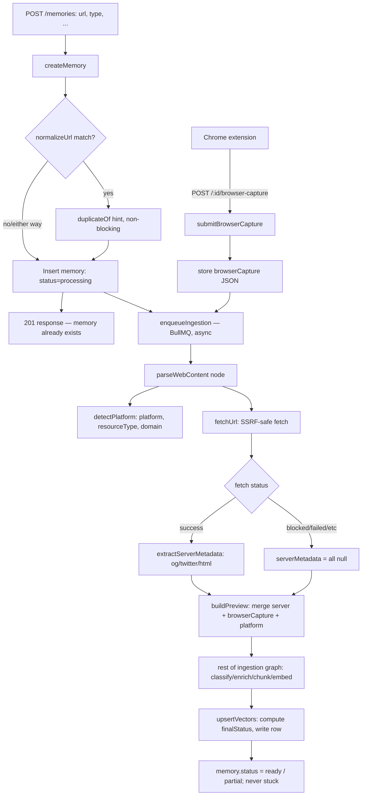

# URL Capture & Preview System

**Status: implemented.** This documents the URL capture, fetch, platform-detection, preview-building, and browser-capture-merge system actually shipped in `server/src/modules/ai/url-processor/`, `server/src/modules/memory/`, `extension/`, and `client/`. Where this diverges from the earlier target designs in `BACKEND_REQUIREMENTS.md`/`AI_REQUIREMENTS.md`, this doc and the code are authoritative for URL handling.

## 1. Guarantee

**If the user gives Memora a valid `http(s)://` URL, a memory for it is always saved** — regardless of whether the page can be fetched, parsed, or enriched by AI. Quality degrades gracefully (`ready` → `partial` → still-saved-but-minimal); a memory is never silently dropped, and a failed preview never means a failed save.

## 2. Architecture



Memory creation (`createMemory`) is synchronous and never depends on network fetches. Everything URL-related — fetching, platform detection, metadata extraction, merging — happens inside the existing async LangGraph ingestion pipeline (`server/src/modules/ai/ingestion/`), specifically inside the `parseWebContent` node, which is the one node rewritten for this system. The rest of the graph (classification, AI insight generation, chunking, embedding) is unchanged and already degraded gracefully before this work — that property is preserved, not rebuilt.

## 3. `UrlProcessor` module (`server/src/modules/ai/url-processor/`)

A small capability layer — no `if (host.includes("instagram"))` branching anywhere else in the codebase.

| File | Responsibility |
|---|---|
| `platform-detector.ts` | `detectPlatform(url) → { platform, resourceType, domain }`. Data-driven table of ~12 known platforms (instagram, x/twitter, youtube, tiktok, linkedin, facebook, reddit, github, medium, dribbble, behance, producthunt), each with a `resourceType(pathname)` classifier so e.g. a YouTube URL resolves to `video`/`short`/`channel`/`playlist`, not one blanket type. Unknown domains get `platform: null`. |
| `server-fetcher.ts` | `fetchUrl(url) → UrlFetchResult`. The one security-sensitive file — see §6. |
| `metadata-extractor.ts` | `extractServerMetadata(html, pageUrl) → PreviewFields`. Regex-based (consistent with the rest of the codebase, no new HTML-parser dependency) extraction of OpenGraph, Twitter Card, `<title>`, meta description, canonical link, favicon. |
| `preview-builder.ts` | `buildPreview(server, browserCapture, platform) → BuiltPreview`. The priority-chain merge (§4) plus `previewStatus`/`previewSource` decision. |
| `types.ts` | Shared types: `FetchStatus`, `UrlFetchResult`, `PreviewFields`, `PlatformInfo`, `PreviewSource`, `PreviewStatus`, `BrowserCapturePayload`. |

## 4. Fallback hierarchy (never a blank preview)

`buildPreview` merges three sources, browser-first (a human's own browser session sees more than a server-side fetch ever can — logged-in pages, JS-rendered content, no bot-blocking):

1. **Browser-captured** (`extension`'s `POST /:id/browser-capture` payload)
2. **Server-fetched** (`og:*` → `twitter:*` → native HTML `<title>`/meta description)
3. *(image only)* **Platform fallback** — a brand-gradient tile rendered client-side (`client/lib/platform-fallback.ts`), never a scraped/downloaded platform logo, for copyright reasons
4. **Generic fallback** — a neutral tile with the memory's type icon, when no platform was even detected

`previewStatus` is `available` (real image present), `partial` (some text but no image), or `unavailable`. `previewSource` records which tier won: `browser | server | platform_fallback | generic_fallback` (`user` is reserved, unused today).

Frontend rendering (`client/components/memory-thumbnail.tsx`, and the same chain in the detail page and memories drawer): real `previewImageUrl` → platform-branded tile (`platform` set, no image) → generic type-icon tile. The card never renders an empty box.

## 5. Platform detection

`detectPlatform` never assumes uniform content per platform — resource type is path-derived:

- **YouTube**: `/shorts/...` → `short`, `/watch` → `video`, `/channel/...` or `/@handle` → `channel`, `/playlist` → `playlist`.
- **GitHub**: `/owner/repo` → `repository`, `/owner/repo/issues/...` → `issue`, `/owner/repo/pull/...` → `pull_request`, `/owner` (single segment) → `profile`.
- Every other listed platform gets at least a coarse `resourceType` (e.g. Instagram: `post`/`reel`/`profile`); anything unrecognized is `platform: null, resourceType: null` — never guessed.

## 6. Security — `server-fetcher.ts`

All SSRF-relevant logic is isolated in this one file:

- **Protocol allowlist**: only `http:`/`https:`. `file://`, `ftp://`, `data:`, `javascript:` are rejected before any I/O.
- **DNS-resolve-then-check**: `assertSafeUrl` resolves the hostname (`dns.lookup(..., { all: true })`) and rejects if *any* resolved address is private/loopback/link-local/cloud-metadata (covers IPv4 `10.x`, `127.x`, `169.254.x` incl. `169.254.169.254`, `172.16–31.x`, `192.168.x`, `100.64–127.x`, and IPv6 `::1`, `fe80:`, `fc/fd` unique-local, `::ffff:`-mapped v4). A hostname that resolves safely today but to a private IP is still caught — checking the literal hostname string alone would miss this.
- **Redirect handling**: manual redirect following (`redirect: "manual"`), capped at 5 hops, **every hop re-validated** through the same `assertSafeUrl` check — a safe initial URL redirecting to an internal address is caught mid-chain, not assumed safe because the first hop was.
- **Response size cap**: streamed read, aborted past 5MB.
- **Timeout**: `AbortSignal.timeout(...)`.
- **robots.txt**: `isAllowedByRobots` is consulted (minimal parser, User-agent block + Disallow prefix matching) and fails **open** on any error reaching `robots.txt` itself — this is a courtesy check, not a hard dependency; we do not attempt to circumvent it when it says no (→ `robots_blocked`), but we also never let a broken robots.txt fetch block a legitimate save.

`fetchUrl` never throws — every failure mode maps to a `FetchStatus` and the memory is still saved.

## 7. `FetchStatus`

`success | blocked | login_required | not_found | timeout | robots_blocked | rate_limited | server_error | invalid_url | empty_response | javascript_required | unknown`

Diagnostic only — never surfaced verbatim to the user. UI copy maps it to plain language (`"Preview unavailable"`, `"Preview captured from your browser"`), never technical detail like "Cloudflare blocked our crawler."

## 8. Memory status

New `memories.status` enum (`server/src/db/enums.ts`): `processing | ready | partial | failed`.

- Set to `processing` at insert (before any fetch/AI work happens).
- Computed by the ingestion graph's terminal node (`upsertVectors`, not a new node — the existing "commit everything" node already reads the whole final state): a link-type memory (`web`/`video`) is `ready` only if `previewStatus === "available"`; every other completed case is `partial`. Non-link types are always `ready` once ingestion completes without throwing.
- `worker.ts`'s `failed` handler sets `status: failed` if a job genuinely throws (a bug, an outage — every node inside the graph already degrades instead of throwing, so this path is rare) — this is what prevents a memory from being stuck at `processing` forever, which every prior version of this pipeline was vulnerable to.

## 9. Duplicate detection (non-blocking)

`server/src/modules/memory/normalize-url.ts`: lowercases host, strips `www.`, strips fragment and tracking params (`utm_*`, `fbclid`, `gclid`, `igshid`, `mc_*`, `ref`, `ref_src`), sorts remaining query params, strips trailing slash. Stored on `memories.normalizedUrl` (indexed on `(user_id, normalized_url)`).

`createMemory` always creates the memory. If a normalized-URL match already exists for that user (excluding trash), the `POST /memories` response includes `duplicateOf: { id, title } | null` — a hint, never a block. The client shows a non-blocking toast; a stricter confirm-before-save flow is explicitly deferred (see §13).

## 10. Browser capture (Chrome extension)

The extension only ever submits what's already visible to the user's own browser session — it does **not** attempt to bypass auth, CAPTCHAs, or bot protection.

- **Auth**: `server/src/shared/middlewares/authenticate.ts` already accepts `Authorization: Bearer <token>` as a first-class path (checked before the cookie fallback), so no backend change was needed. The extension's background service worker (`extension/src/background/service-worker.ts`) reads the httpOnly `memora_access_token` cookie via `chrome.cookies.get` (requires the `cookies` permission + a host permission for the API origin) and mirrors it into `chrome.storage.local`, which the popup and `extension/src/lib/api.ts` read to attach the Bearer header. A prior version tried to read this cookie from page-context `localStorage` in the content script — that can never work against an httpOnly cookie, and has been removed.
- **Popup flow** (`extension/src/popup/Popup.tsx`): on open, syncs auth, reads the active tab, asks the content script for already-scraped `og:description`/`og:image`/`keywords` (`GET_METADATA` message — unchanged, this part already worked), then makes a real `POST /api/v1/memories` with `type: "web"`, the tab's URL/title/favicon, and the scraped description/previewImageUrl/keywords — fixing the previously-documented bug where this metadata was scraped and then dropped on the floor.
- Background service worker's context-menu / keyboard-shortcut save paths are **not** wired to the real API in this pass (see §13) — popup-only.

### `POST /memories/:id/browser-capture`

Request body (`browserCaptureInputSchema`, size-capped, no raw HTML accepted):

```json
{
  "title": "string, max 500",
  "description": "string, max 2000",
  "canonicalUrl": "url",
  "faviconUrl": "url",
  "imageUrl": "url",
  "platform": "string, max 50",
  "resourceType": "string, max 50",
  "selectedText": "string, max 5000",
  "capturedAt": "ISO string"
}
```

Verifies ownership (404 if the memory isn't the caller's), stores the payload verbatim on `memories.browserCapture` (JSONB), then re-enqueues ingestion so `parseWebContent`/`buildPreview` picks it up on the next run and can upgrade a `partial`/`unavailable` preview. Response: the updated `MemoryDetail`.

## 11. Other new API routes

All follow the existing `router → validator (zod) → controller → service` module structure (`server/src/modules/memory/`).

- **`POST /memories/:id/refresh-preview`** — ownership check, sets `status: processing`, re-enqueues ingestion. A failed refresh leaves prior preview fields untouched: `upsertVectors` only ever writes a field when the corresponding pipeline-state value is non-null (`state.X ?? undefined` — Drizzle excludes `undefined` columns from the `UPDATE`), so nothing gets clobbered by a bad retry.
- **`GET /memories/:id/processing-status`** — thin read of `{ status, previewStatus, fetchStatus }` off the existing row.
- **`GET /memories/:id`** (existing route) — response gains `status`, `previewStatus`, `previewSource`, `platform`, `resourceType`, `canonicalUrl`, `captureMethod` on `MemoryListItem`/`MemoryDetail`. `fetchStatus` is intentionally **not** exposed on list/detail responses (diagnostics only, per §7) — it's only readable via `processing-status`.
- **`POST /memories`** (existing route) — gains optional `captureMethod: "server" | "extension" | "manual"` on input (defaults to `"manual"`), and `duplicateOf` on the response (§9). Still responds `201` with the memory immediately; ingestion runs after, in the background.

## 12. Data model

No new tables — `memories` was extended directly (`server/src/db/schema.ts`), per "don't duplicate existing tables unnecessarily." New columns: `status`, `normalizedUrl`, `previewStatus`, `previewSource`, `platform`, `resourceType`, `canonicalUrl`, `fetchStatus`, `captureMethod`, `browserCapture` (jsonb). Migration `20260830051935_numerous_red_shift` backfills existing rows (`status = ready` where `resourceCategory` was already set, `partial` otherwise) so pre-existing memories don't show a permanent false "processing" badge.

## 13. Known limitations / deferred

- No automated test suite exists yet in this repo (`server/CLAUDE.md` confirms this — a project-wide setup decision, not scoped to this feature). Verified via live throwaway `_debug_*.ts` scripts instead, per this repo's established pattern.
- Chrome extension: only the popup's save flow is wired to the real API. The background service worker's context-menu ("save this page") and keyboard-shortcut flows are still simulated.
- Duplicate detection is a non-blocking hint only — no confirm-before-save dialog.
- No image caching/mirroring — `previewImageUrl` always points at the original external URL (or a client-rendered fallback tile), never a Memora-hosted copy. A future `externalImageUrl`/`cachedImageUrl` split would be needed for images that expire.
- The ingestion graph stayed sequential (no parallel fan-out) — an intentional choice, since memory creation already happens synchronously before ingestion starts, so AI/embedding latency was never on the save's critical path to begin with.

## 14. Worked examples

**A. Normal site, full metadata** (e.g. a GitHub repo URL) — `fetchUrl` → `success`; `extractServerMetadata` finds `og:title`/`og:image`; `buildPreview` → `previewStatus: available`, `previewSource: server`; `upsertVectors` → `status: ready`.

**B. Instagram, blocked server-side** — `detectPlatform` → `{ platform: "instagram", resourceType: "post" }`; `fetchUrl` → `blocked` (non-2xx or bot-blocked response); `serverMetadata` all null; no browser capture yet → `buildPreview` → `previewStatus: partial, previewSource: platform_fallback`; `status: partial`. Memory fully exists and is viewable; the client renders the Instagram-branded gradient tile; "Open original" still works.

**C. X/Twitter, blocked server-side** — same shape as B with `platform: "x"`.

**D. Unknown domain, no metadata at all** — `detectPlatform` → `{ platform: null }`; fetch may succeed but the page has no OG/Twitter/title tags → `buildPreview` → `previewStatus: unavailable` (no title/description either) or `partial` (has a `<title>` at least), `previewSource: generic_fallback`; client renders the neutral type-icon tile.

**E. Browser-capture success** — extension's content script scrapes `og:image`/description on a page the server couldn't fetch (e.g. behind login); `POST /:id/browser-capture` stores it; re-run of `parseWebContent` merges it in — `buildPreview` prefers the browser fields over the (still-failed) server fetch → `previewStatus: available, previewSource: browser`; `status` upgrades from `partial` to `ready`.

**F. Complete URL-only fallback** — invalid/malformed URL, or a fetch that fails in every way (DNS failure, timeout, and no browser capture ever submitted): `createMemory` still succeeds (the URL itself was syntactically valid enough to pass `z.string().url()`, or the type falls back to a plain note-like save if not even that); ingestion's `parseWebContent` returns empty `rawContent` and `previewStatus: unavailable`; the memory is saved, titled, and viewable with just its raw URL — never lost.
